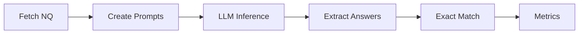

# Natural Questions - RAG Evaluation Dataset

This directory contains scripts and data for evaluating Retrieval-Augmented Generation (RAG) systems using the **Natural Questions (Open)** dataset, the gold standard for fact retrieval tasks.

## Overview

**Natural Questions (Open)** is a question answering dataset created from real Google search queries. It contains questions with multiple valid answer strings, making it ideal for evaluating RAG systems and fact retrieval capabilities.

**Key Features**:
- ✅ **Real User Queries**: Questions from actual Google searches
- ✅ **Multiple Valid Answers**: Each question has a list of acceptable answer strings
- ✅ **Short Answer Format**: Answers are entities or short phrases (e.g., "Paris", "Rocky Mountains")
- ✅ **Gold Standard**: Widely used benchmark for RAG evaluation
- ✅ **Exact Match Metric**: Clear, objective evaluation

## Directory Contents

```
rag/
├── README.md                           # This documentation
├── fetch_natural_questions.py          # Fetch dataset from HuggingFace
├── evaluate_natural_questions.py       # Exact match evaluator
└── example_usage.py                    # End-to-end example with LLM
```

## Dataset Information

### Source
- **Name**: Natural Questions (Open)
- **HuggingFace ID**: `nq_open`
- **Alternative**: `google-research-datasets/natural_questions` (full version with HTML)
- **Format**: Open-domain QA (no document context required)

### Data Structure

Each question has:
- `question`: The question text (from Google search)
- `answer`: List of valid answer strings

**Example**:
```json
{
  "question": "what mountain range runs through colorado",
  "answer": ["Rocky Mountains", "The Rockies", "Rockies"]
}
```

### Splits
- **Train**: ~87,925 questions
- **Validation**: ~3,610 questions

**Recommended**: Use **validation split** for evaluation (smaller, representative)

## Evaluation Metric

### Exact Match

A response is considered **correct** if it contains **any** of the valid answer strings (case-insensitive, normalized).

**Normalization**:
1. Convert to lowercase
2. Remove articles (a, an, the)
3. Remove punctuation
4. Normalize whitespace
5. Check substring match

**Example**:
- Question: "What is the capital of France?"
- Valid Answers: `["Paris"]`
- Model Response: "The answer is Paris."
- **Normalized**: "answer is paris"
- **Match**: ✓ (contains "paris")

### Complexity Threshold

From `BENCHMARK_THRESHOLDS.md`:
- **Threshold**: τ < 0.50 (50%)
- **Basis**: Multi-hop vs. single-hop performance drop-off
- **Interpretation**: Below 50% accuracy indicates complex retrieval or reasoning required

## Scripts

### 1. fetch_natural_questions.py

Fetches Natural Questions from HuggingFace and formats for evaluation.

**Features**:
- Load from `nq_open` dataset
- Sample n questions (for quick testing)
- Multiple prompt styles (standard, with_context, instruction_following)
- Save to JSON

**Usage**:
```bash
python fetch_natural_questions.py
```

**Output**: `natural_questions_validation_100.json`

**Example Questions**:
```python
from fetch_natural_questions import fetch_natural_questions

# Fetch 50 validation questions
questions = fetch_natural_questions(split="validation", n_samples=50)

# Create prompts
from fetch_natural_questions import create_rag_prompt
prompt = create_rag_prompt(questions[0]["question"], style="standard")
```

### 2. evaluate_natural_questions.py

Evaluates model responses using exact match with flexible normalization.

**Features**:
- Exact match evaluation
- Multiple valid answers support
- Flexible answer extraction (handles "Answer:", "The answer is", etc.)
- Normalization (case, punctuation, articles)
- Detailed results and summary metrics

**Usage**:
```python
from evaluate_natural_questions import NaturalQuestionsEvaluator

# Initialize evaluator
evaluator = NaturalQuestionsEvaluator(case_sensitive=False)

# Evaluate
results, metrics = evaluator.evaluate(questions, model_responses)

# Print metrics
print(f"Accuracy: {metrics['accuracy']:.2%}")
print(f"Correct: {metrics['correct']} / {metrics['total_questions']}")
```

**Metrics**:
- `accuracy`: Percentage of correct answers
- `exact_match_rate`: Same as accuracy (for consistency with literature)
- `correct`: Number of correct responses
- `incorrect`: Number of incorrect responses

### 3. example_usage.py

Complete end-to-end example with LLM API integration.

**Features**:
- Fetch questions
- Generate responses via OpenRouter API
- Evaluate and save results
- Full workflow demonstration

**Usage (Simple Demo)**:
```bash
python example_usage.py
```

**Usage (Full Evaluation)**:
```bash
# Requires OPENROUTER_API_KEY
export OPENROUTER_API_KEY="your-key"
python example_usage.py --full
```

**Output Files**:
- `results/questions.json`: Fetched questions
- `results/responses.json`: Model responses
- `results/evaluation_results.json`: Full evaluation results

## Workflow

### Standard Evaluation Process



**Steps**:
1. **Fetch**: Load Natural Questions from HuggingFace
2. **Prompt**: Format questions as prompts (with or without context)
3. **Inference**: Get model responses via API
4. **Extract**: Parse answer from response
5. **Match**: Check against valid answers
6. **Metrics**: Compute accuracy

### RAG-Specific Evaluation

For RAG systems (with retrieval):

```python
from fetch_natural_questions import create_rag_prompt

# Assume you have a retriever
def retrieve_context(question: str) -> str:
    # Your retrieval logic
    return "Retrieved documents..."

# Create RAG prompt with context
context = retrieve_context(question)
prompt = create_rag_prompt(question, context, style="with_context")

# Get response from LLM
response = model.generate(prompt)

# Evaluate
is_correct, matched = evaluator.check_exact_match(response, valid_answers)
```

## Example Evaluation

### Sample Run

```python
questions = [
    {
        "question": "What mountain range runs through Colorado?",
        "answers": ["Rocky Mountains", "The Rockies", "Rockies"]
    },
    {
        "question": "Who wrote 'Romeo and Juliet'?",
        "answers": ["William Shakespeare", "Shakespeare"]
    },
    {
        "question": "What is the capital of France?",
        "answers": ["Paris"]
    }
]

responses = [
    "The Rocky Mountains run through Colorado.",
    "William Shakespeare wrote Romeo and Juliet.",
    "The capital is London."  # Incorrect
]

evaluator = NaturalQuestionsEvaluator()
results, metrics = evaluator.evaluate(questions, responses)

# Results:
# Accuracy: 66.67% (2/3 correct)
```

### Output Format

**Summary Metrics**:
```json
{
  "total_questions": 3,
  "correct": 2,
  "incorrect": 1,
  "accuracy": 0.6667,
  "exact_match_rate": 0.6667
}
```

**Detailed Results**:
```json
{
  "question": "What mountain range runs through Colorado?",
  "ground_truth": ["Rocky Mountains", "The Rockies", "Rockies"],
  "model_response": "The Rocky Mountains run through Colorado.",
  "normalized_response": "rocky mountains run through colorado",
  "is_correct": true,
  "matched_answer": "Rocky Mountains"
}
```

## Answer Extraction Logic

The evaluator handles various response formats:

| Response Format | Extracted Answer |
|-----------------|------------------|
| "Answer: Paris" | "Paris" |
| "The answer is Paris." | "Paris" |
| "Paris is the capital of France." | "Paris is the capital of France" |
| "The city is Paris" | "The city is Paris" |

**Strategy**:
1. Try to extract after "Answer:" or "answer is"
2. Fall back to first sentence
3. Normalize and check substring match

This flexible extraction handles diverse model response styles.

## Complexity Analysis

### What Makes a Question Complex?

**Complex** (τ < 50%):
- Requires multi-hop reasoning
- Needs temporal knowledge
- Involves entity disambiguation
- Requires world knowledge integration

**Simple** (τ ≥ 50%):
- Single-hop fact retrieval
- Common knowledge
- Unambiguous entities
- Direct lookup

**Example Complex**:
- "Who was the president during the Cuban Missile Crisis?"
  - Requires: (1) Know when Crisis occurred, (2) Know president at that time

**Example Simple**:
- "What is the capital of France?"
  - Direct fact retrieval

## Integration with Project

### Connection to RAG Intent

Natural Questions evaluates the **RAG** intent in the LLM Jury project:
- Tests fact retrieval capability
- Measures accuracy on real user queries
- Validates model's parametric knowledge
- Benchmark for retrieval-augmented systems

### Connection to Complexity Threshold

From `BENCHMARK_THRESHOLDS.md`:
- **Metric**: Exact Match
- **Threshold**: τ < 0.50 (50%)
- **Basis**: Multi-hop vs. single-hop drop-off
- **Usage**: Classify prompts as simple/complex for RAG tasks

### Usage in Model Selection

Models with high Natural Questions scores:
- Strong parametric knowledge
- Good fact retrieval
- Suitable for RAG applications
- Reliable for information queries

## Performance Benchmarks

### SOTA Performance (2024)

| Model | Exact Match | Notes |
|-------|-------------|-------|
| GPT-4 | ~60% | Strong on multi-hop |
| Claude 3.5 | ~58% | Good factual accuracy |
| GPT-3.5 | ~45% | Below threshold (complex) |
| Smaller models | ~30-40% | Struggle with retrieval |

**Threshold**: 50% (models below this struggle with complex queries)

## Dependencies

```bash
pip install datasets
pip install openai  # For example_usage.py with API
pip install python-dotenv  # For environment variables
```

## Data Provenance

### Source
- **Original Dataset**: Natural Questions (Google Research)
- **HuggingFace**: `nq_open` (simplified, open-domain version)
- **License**: Apache 2.0
- **Collection**: Real Google search queries with answers from Wikipedia

### Processing
1. Questions fetched directly from HuggingFace
2. No additional preprocessing (use as-is)
3. Answers are pre-extracted short spans
4. Validation split recommended for evaluation

### Data Authenticity
✅ **Official HuggingFace dataset**  
✅ **No modification or imputation**  
✅ **Direct from source**  
✅ **Gold standard benchmark**  

## Troubleshooting

### Common Issues

**Issue**: "Dataset not found"
```bash
# Solution: Install datasets library
pip install datasets
```

**Issue**: "API key not found"
```bash
# Solution: Set environment variable
export OPENROUTER_API_KEY="your-key"
```

**Issue**: "False negatives in evaluation"
```bash
# Solution: Check if answer is truly equivalent
# The evaluator uses substring matching, so "NYC" should match "New York City"
# If needed, add answer variant to valid_answers list
```

## Extensions

### Add Retrieval Context

Modify prompts to include retrieved documents:

```python
from fetch_natural_questions import create_rag_prompt

# Your retriever
docs = retriever.search(question, top_k=3)
context = "\n".join([doc.text for doc in docs])

# Create RAG prompt
prompt = create_rag_prompt(question, context, style="with_context")
```

### Evaluate Multiple Models

```python
models = ["openai/gpt-4o-mini", "anthropic/claude-3.5-sonnet"]
results_by_model = {}

for model_id in models:
    responses = generate_responses_with_llm(questions, model_id=model_id)
    results, metrics = evaluator.evaluate(questions, responses)
    results_by_model[model_id] = metrics

# Compare
for model_id, metrics in results_by_model.items():
    print(f"{model_id}: {metrics['accuracy']:.2%}")
```

### Complexity-Stratified Evaluation

```python
# Classify questions by complexity (requires pre-computed scores)
simple_questions = [q for q in questions if q.get('complexity') == 'simple']
complex_questions = [q for q in questions if q.get('complexity') == 'complex']

# Evaluate separately
simple_results, simple_metrics = evaluator.evaluate(simple_questions, simple_responses)
complex_results, complex_metrics = evaluator.evaluate(complex_questions, complex_responses)

print(f"Simple Accuracy: {simple_metrics['accuracy']:.2%}")
print(f"Complex Accuracy: {complex_metrics['accuracy']:.2%}")
```

## References

### Natural Questions Citation

```bibtex
@article{kwiatkowski2019natural,
  title={Natural Questions: A Benchmark for Question Answering Research},
  author={Kwiatkowski, Tom and Palomaki, Jennimaria and Redfield, Olivia and others},
  journal={Transactions of the Association for Computational Linguistics},
  volume={7},
  pages={452--466},
  year={2019},
  url={https://ai.google.com/research/NaturalQuestions}
}
```

### Related Documentation
- **Threshold Methodology**: `KDD/data/BENCHMARK_THRESHOLDS.md`
- **RAG Intent**: (link to your RAG documentation)
- **Model Evaluation**: (link to evaluation results)

## File Sizes

| File | Size | Description |
|------|------|-------------|
| fetch_natural_questions.py | ~4 KB | Dataset fetcher |
| evaluate_natural_questions.py | ~7 KB | Exact match evaluator |
| example_usage.py | ~6 KB | End-to-end example |
| README.md | ~14 KB | This documentation |

**Total**: ~31 KB of scripts + data files (variable)

**Typical Data Sizes**:
- 50 questions: ~5 KB
- 100 questions: ~10 KB
- Full validation set (3,610): ~300 KB

## Quick Start

### 1. Fetch Data
```bash
python fetch_natural_questions.py
```

### 2. Simple Demo
```bash
python example_usage.py
```

### 3. Full Evaluation (with API)
```bash
export OPENROUTER_API_KEY="your-key"
python example_usage.py --full
```

### 4. Custom Evaluation
```python
from fetch_natural_questions import fetch_natural_questions
from evaluate_natural_questions import NaturalQuestionsEvaluator

# Load questions
questions = fetch_natural_questions(split="validation", n_samples=100)

# Your model inference
responses = [your_model.generate(q["question"]) for q in questions]

# Evaluate
evaluator = NaturalQuestionsEvaluator()
results, metrics = evaluator.evaluate(questions, responses)

print(f"Accuracy: {metrics['accuracy']:.2%}")
```

## Contact

For questions about Natural Questions data or RAG evaluation:
- Review evaluation script: `evaluate_natural_questions.py`
- Check threshold documentation: `BENCHMARK_THRESHOLDS.md`
- Consult Natural Questions paper: https://ai.google.com/research/NaturalQuestions

**Last Updated**: December 13, 2025  
**Dataset**: Natural Questions (Open)  
**HuggingFace**: `nq_open`  
**Metric**: Exact Match
