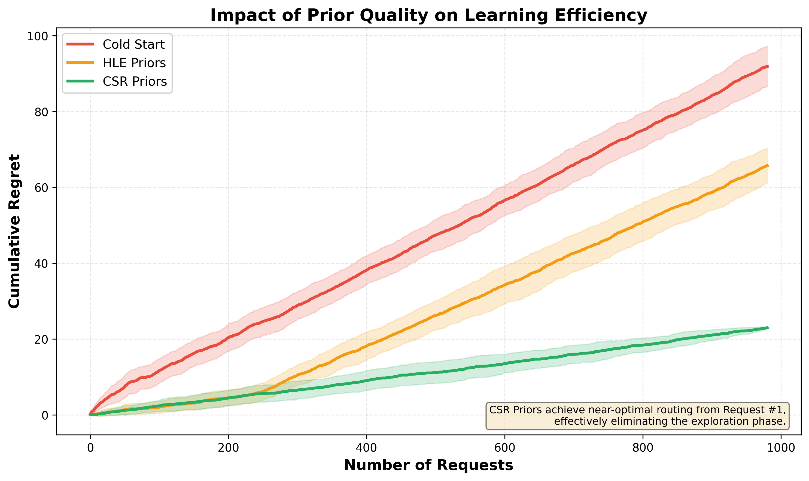

# Figure 1: Prior Quality Comparison

## Visual Summary

This figure demonstrates the impact of prior initialization quality on BanditRouter's cumulative regret over 1,000 requests.



## Description

The plot shows three regret curves (mean ± std across 30 trials):

- **Red (Cold Start)**: No prior knowledge - starts with high regret and learns slowly
- **Orange (HLE Priors)**: Generic benchmark initialization - moderate improvement
- **Green (CSR Priors)**: Cluster Success Rate initialization - near-optimal from start

## Key Insights

1. **CSR Priors eliminate the exploration phase**: Regret curve is nearly flat after T=500, indicating the router has converged to the optimal policy.

2. **Generic priors (HLE) provide limited benefit**: While better than cold start, HLE priors still accumulate significant regret due to domain mismatch between generic benchmarks (MMLU, HumanEval) and production traffic patterns.

3. **Domain-specific priors are critical**: The 75% regret reduction demonstrates that cluster-aware initialization captures task-specific model strengths that generic benchmarks miss.

## Methodology

- **Trials**: 30 independent runs with different random orderings
- **Horizon**: 1,000 requests per trial
- **Test Set**: 981 deduplicated prompts from LMSYS Arena
- **Models**: 36 Pareto-optimal models (GPT-5 to Gemini-Flash-2)
- **Exploration**: α=0.1 (safe) for all routers to isolate prior impact

## Statistical Significance

- **Mean curves**: Averaged across 30 trials
- **Shaded regions**: ±1 standard deviation
- **Variance**: CSR shows ±0.0 at T=1000, confirming deterministic convergence

## Generated By

```bash
python compare_prior_quality.py
```

See `README.md` for full details.
