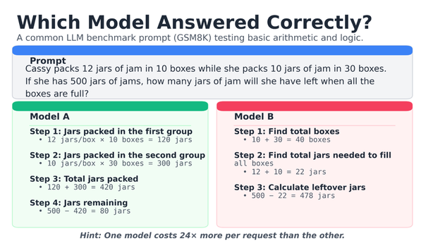
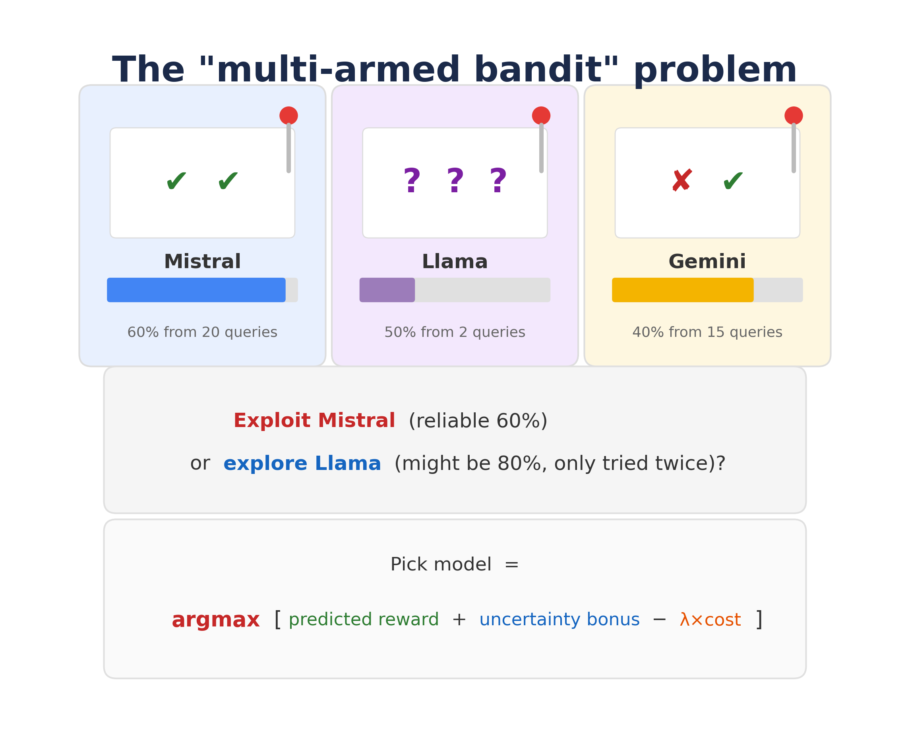
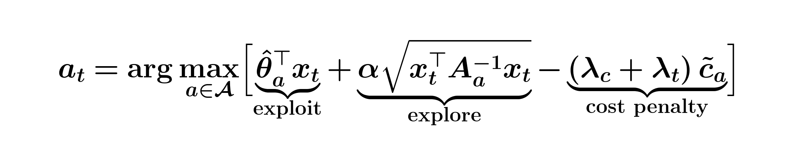
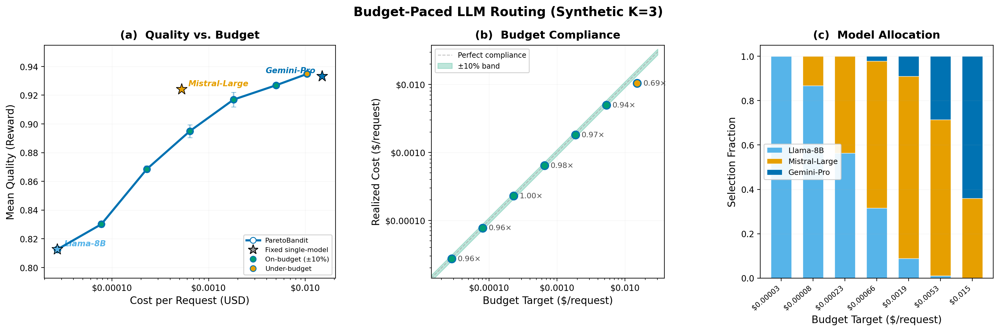
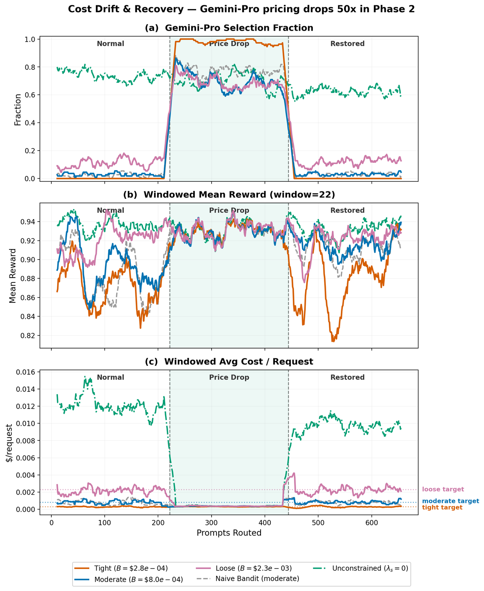
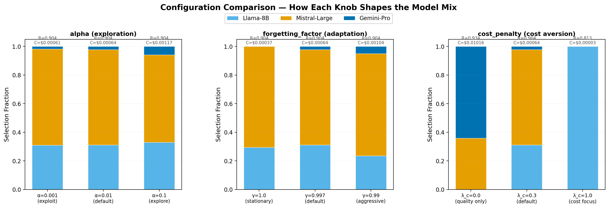

# Your LLM API Bill Is a Slot Machine: Here's How Bandits Can Fix It

**An open-source router that learns which model to call, stays on budget, and adapts when things change.**


---

If you're calling LLM APIs in production, you know the feeling. You have a portfolio of models (maybe a budget-friendly 8B, a solid mid-tier, and a flagship frontier model) and you're making ad-hoc rules about which one gets each request. Simple questions go cheap; hard reasoning goes expensive. It sort of works, until you check the bill at the end of the month and realize your rules weren't as clever as you thought. You're left wondering: could you have gotten the same quality for less, or better quality for the same spend?

Here's a real example. This is a basic arithmetic question from the GSM8K benchmark:

<p align="center">

<br><em>Model A is Mistral-Large ($0.0005/request). Model B is Gemini-2.5-Pro ($0.015/request). The frontier model costs 24x more and got it wrong.</em>
</p>

The cost spread between models can be **530x**, and no single model dominates on every input. That cheap mid-tier model? It handles many prompts just as well as, or better than, the frontier model at a fraction of the cost. Picking the wrong model for each prompt either burns money or tanks quality. And the right answer changes depending on the prompt, the budget, and even on whether a provider quietly updated their model last Tuesday.

You're essentially playing a **multi-armed bandit**, whether you realize it or not. If you haven't seen the term before, the idea is simple: imagine a row of slot machines, each with a different (unknown) payout rate. You want to maximize your winnings, but you have to balance *exploiting* the machine that's been paying well against *exploring* the one you've only tried twice that might be even better.

<p align="center">

<br><em>Do you exploit Mistral (reliable 60% from 20 queries) or explore Llama (50% from just 2 queries, it might actually be 80%)? The scoring formula at the bottom is how ParetoBandit decides: predicted reward + uncertainty bonus - cost penalty.</em>
</p>

Each model is a machine, each prompt is a pull, and you're trying to maximize quality while keeping your API bill under control. This is the classic exploration-exploitation tradeoff that bandit algorithms were built for, with a twist: you also have a hard budget constraint.

[ParetoBandit](https://github.com/ParetoBandit/ParetoBandit) is an open-source adaptive router that formalizes exactly this intuition. It uses cost-aware contextual bandits to learn which model to call for each prompt, enforces a dollar budget you set, and adapts online when prices shift or model quality degrades, all with a routing decision that takes **22 microseconds** on CPU (the end-to-end latency including prompt embedding is 9.8 ms, under [0.4% of a typical LLM inference call](https://github.com/ParetoBandit/ParetoBandit/tree/main/paper#computational-efficiency)). In this post, I'll walk through the problem, the key ideas, and show you how to run it yourself.

---

## The Problem: Why Static Routing Fails

Consider a real three-model portfolio:

| Model | Tier | Cost per Request |
|---|---|---|
| Llama-3.1-8B | Budget | $0.00003 |
| Mistral-Large | Mid-tier | $0.00053 |
| Gemini-2.5-Pro | Frontier | $0.015 |

That's a **530x** spread from cheapest to most expensive. And here's the twist: Gemini-Pro scores 0.932 on a quality rubric while Mistral-Large scores 0.923, nearly as good at 28x less cost. For many prompts, the cheaper model is *the right choice*. The question isn't *which model to use*, it's *which model to use for this prompt, given this budget, right now*.

There's been excellent work on LLM routing: cascading approaches [6], classifiers trained on preference data [7], and systems that incorporate budget targets [9]. These have pushed the field forward significantly. But most of them learn a fixed policy offline and freeze it at serving time, which works well when conditions are stable. The challenge is that production environments are often *not* stable:

1. **Budgets need continuous enforcement.** You set a cost target, but prompt distributions shift, and a fixed routing table can drift off budget.
2. **Quality regresses silently.** Providers update models behind their APIs. The "best" model might quietly change, and a frozen router won't notice until someone checks.
3. **New models launch constantly.** Integrating a new model into a static routing table typically requires offline evaluation and retraining.

These are real-world pressures. In 2024 alone, OpenAI cut GPT-4o input prices by roughly 50%, and providers routinely push silent model updates that shift quality distributions. Research has documented this phenomenon systematically: Chen et al. (2023) and Ma et al. (2024) showed that LLM behavior can change substantially between API versions without any announcement.

ParetoBandit builds on the strengths of prior routing work and adds the machinery to handle these messy production realities: closed-loop budget enforcement in dollars, and continuous adaptation to non-stationarity.

---

## Enter ParetoBandit: The Core Idea

ParetoBandit frames LLM routing as a **contextual bandit** problem ([paper, Section 2](https://github.com/ParetoBandit/ParetoBandit/tree/main/paper)). If you're familiar with LinUCB from the recommender systems literature, that's the backbone. What ParetoBandit adds on top are two ingredients designed specifically for messy production deployments: **dollar-denominated per-request budget ceilings** enforced in closed loop, and **non-stationarity handling** that lets the system adapt continuously when model quality or pricing shifts mid-deployment.

When a prompt arrives, the router encodes it into a compact feature vector (using a lightweight sentence embedding + PCA; [paper, Section 2.1](https://github.com/ParetoBandit/ParetoBandit/tree/main/paper)), then selects the model with the highest score ([paper, Eq. 2](https://github.com/ParetoBandit/ParetoBandit/tree/main/paper)):

<p align="center">

</p>

The three underbraced terms make the tradeoff explicit. **Exploit** uses the learned reward model to predict quality for this specific prompt. **Explore** adds a confidence bonus for uncertain models (scaled by `alpha`), so the router keeps testing models it hasn't seen enough of. **Cost penalty** discourages expensive models. The key design choice: the penalty combines a static weight `lambda_c` (your baseline cost aversion, set once) with a *dynamic* dual variable `lambda_t` that adapts in real time based on actual spending.

After observing the response quality, the router updates its estimates. Over time, it converges on the optimal mix, but crucially, it never stops learning. Every request makes the system smarter.

Three mechanisms make this work in production:

### Budget Pacer: Dollar-denominated cost ceilings (Eqs. 3-4)

Most routing approaches handle cost through static penalty weights or offline budget allocation, which works well in controlled settings. For production systems where traffic volume is unpredictable and costs need to stay within a specific dollar figure, ParetoBandit takes a different approach: you set a **per-request cost ceiling *B* in real dollars** (say, $0.001/request), and an online primal-dual mechanism enforces it continuously ([paper, Section 3.2](https://github.com/ParetoBandit/ParetoBandit/tree/main/paper)). Two equations do the work:

<p align="center">

</p>

Eq. 3 smooths the raw cost signal with an EMA (half-life of ~14 requests) to prevent sawtooth oscillations from single expensive calls. Eq. 4 is the adaptive Lagrange update: when smoothed cost exceeds the budget *B*, the ratio exceeds 1, so `lambda_t` rises, penalizing expensive models in Eq. 2. When spending is under budget, `lambda_t` falls, releasing the router to pursue quality. Normalizing the gradient by *B* makes the step size portfolio-independent. The system never needs to know the total request volume; it self-regulates at any traffic scale.

### Geometric Forgetting: Adapting to non-stationarity (Eqs. 7-8)

The second ingredient addresses a challenge that becomes apparent in long-running deployments: model quality and pricing are *not stationary* ([paper, Section 2.4](https://github.com/ParetoBandit/ParetoBandit/tree/main/paper)). Providers update models, adjust pricing, or deprecate endpoints. Rather than treating all historical observations equally, ParetoBandit exponentially discounts them ([paper, Section 3.3, Eqs. 7-8](https://github.com/ParetoBandit/ParetoBandit/tree/main/paper)):

<p align="center">

</p>

Here `dt` is the number of steps since the last update to model `a`, and `gamma` (e.g. 0.997) controls the memory window. The key insight: at `gamma = 0.997`, observations from ~333 steps ago retain only 37% of their weight, and after ~1,000 steps the contribution drops to 5%. This means the router can override stale estimates quickly when conditions change, without needing to *detect* the change explicitly. The forgetting is passive and continuous: if a model's quality drops, the bad observations naturally dominate the recent window. Set `gamma = 1.0` for a stationary bandit that never forgets.

**Hot-Swap Registry: Add or remove models at runtime** ([paper, Section 3.6](https://github.com/ParetoBandit/ParetoBandit/tree/main/paper))**.** New models get a brief forced-exploration phase (about 20 prompts), after which the bandit has enough evidence to decide whether the newcomer deserves traffic. Crucially, it *discriminates* rather than blindly adopting: expensive models get budget-gated and low-quality models get rejected after bounded exploration. You don't need to restart anything or retrain. Just call `router.add_arm()` and the system figures out where the new model fits.

---

## Seeing It in Action: Budget Pacing

The first thing most teams want to know: *can I set a dollar budget and trust the router to stay on it?*

Here's what happens when we sweep budget targets across the full cost range, routing 1,824 benchmark prompts through the three-model portfolio:


**(a)** The router traces a continuous quality-cost curve through the fixed-model baselines (stars). **(b)** Budget compliance: realized cost tracks the target closely, with utilization ranging from 0.96x to 1.00x for binding budgets. **(c)** The model mix shifts smoothly from Llama-dominant at tight budgets to Gemini-heavy at loose ones.

The key result ([paper, Section 4.2](https://github.com/ParetoBandit/ParetoBandit/tree/main/paper)): **at a budget of $0.00023/request, the router achieves 92% of Gemini-Pro's quality at just 2% of its cost**, by blending 56% Llama and 44% Mistral based on prompt context. When the budget is loose enough that cost never binds, the router recovers 96.4% of an oracle that always picks the single best model per prompt.

Notice what's happening in panel (c): at tight budgets, the mix is almost entirely Llama with a dash of Mistral. As the budget loosens, Mistral takes over the majority. Only at the loosest budgets does Gemini-Pro earn meaningful traffic. The router isn't making binary choices. It's learning a context-dependent mixing policy that respects your cost constraint.

This effectively turns model selection from a discrete choice among K fixed operating points into a **continuous budget dial**: set the dollar ceiling, and the router discovers the best quality mix beneath it.

---

## Seizing Opportunities: Adapting to Price Shifts

Budget compliance under stable conditions is only the start. The more exciting question is: what happens when the market moves in your favor?

Imagine this scenario: you wake up one morning and a provider has **slashed prices by 50x** on their flagship model. Suddenly, the most expensive model in your portfolio is essentially free. This is a huge opportunity: you can get premium quality at budget prices, but only if your router notices and acts on it. A router with a frozen policy would keep its old allocation, missing a significant quality win. ParetoBandit picks it up automatically.

We simulate exactly this three-phase scenario ([paper, Section 4.3](https://github.com/ParetoBandit/ParetoBandit/tree/main/paper)). In Phase 1, everything runs normally. In Phase 2, Gemini-Pro's pricing drops from $0.015/request to $0.0003/request. In Phase 3, original pricing is restored.

<p align="center">

<br><em>Three phases: Normal, Price Drop, Restored. Top: Gemini-Pro selection fraction. Middle: windowed mean reward. Bottom: windowed average cost. The router automatically exploits cheap premium routing during the drop, then recovers compliance when prices are restored.</em>
</p>

When Gemini becomes nearly free, the BudgetPacer detects the cost change through its smoothed cost signal. The dual variable decays, Gemini adoption surges, and the system delivers a **+0.071 quality lift** at tight budgets, all automatically and within budget. Users get premium-model quality at budget-model prices without anyone touching a config file. When prices snap back in Phase 3, the dual variable rises again and the router recovers budget compliance without any operator intervention.

This full round-trip (seize the opportunity, then recover gracefully) illustrates why closed-loop budget enforcement matters for production deployments. The budget pacer is the critical piece: a bandit without it *also* detects the price drop (the forgetting mechanism works in both cases), but it overshoots the cost ceiling by up to **5.5x** when prices are restored because there's no feedback loop on cost. The budget pacer is what keeps the system both opportunistic and honest.

The paper also evaluates a complementary scenario ([paper, Section 4.4](https://github.com/ParetoBandit/ParetoBandit/tree/main/paper)): silent quality degradation, where Mistral-Large's quality drops by 18% without any warning from the API. ParetoBandit detects the problem purely through the reward signal, reroutes traffic, and then re-discovers the recovered model in Phase 3, all while maintaining budget compliance.

---

## Try It Yourself

ParetoBandit ships with a full demo and an **interactive notebook** so you can experiment hands-on.

**Install:**

```bash
pip install paretobandit[demo]
```

**Option 1: The interactive notebook (recommended).** The [demo playground notebook](https://github.com/ParetoBandit/ParetoBandit/blob/main/examples/demo_playground.ipynb) walks you through loading data, running trials, and sweeping parameters step by step. You can see the effect of each knob immediately. Here's a taste, running three trials with different cost aversion settings:

```python
from pareto_bandit.demo import load_evaluation_data, run_trial, ARM_ORDER, ARM_SHORT
from pareto_bandit.feature_service import FeatureService

fs = FeatureService()
train, test = load_evaluation_data(
    prompts_file=DemoConfig().prompts_file,
    feature_service=fs, n_prompts=1000, seed=42,
)

for label, cp in [("quality-only", 0.0), ("balanced", 0.3), ("cost-focused", 1.0)]:
    trial = run_trial(train, test, cost_penalty=cp, seed=42)
    fracs = ", ".join(f"{ARM_SHORT[a]}={trial.model_fractions[a]:.0%}" for a in ARM_ORDER)
    print(f"cost_penalty={cp} ({label}):  reward={trial.mean_reward:.4f}  cost=${trial.mean_cost:.6f}  [{fracs}]")
```

```
cost_penalty=0.0 (quality-only):  reward=0.9040  cost=$0.010616  [Llama-8B=3%, Mistral-Large=33%, Gemini-Pro=64%]
cost_penalty=0.3 (balanced):      reward=0.9040  cost=$0.000640  [Llama-8B=34%, Mistral-Large=63%, Gemini-Pro=3%]
cost_penalty=1.0 (cost-focused):  reward=0.8130  cost=$0.000030  [Llama-8B=99%, Mistral-Large=1%, Gemini-Pro=0%]
```

At `cost_penalty=0.3`, the router achieves the same quality as the unconstrained version while cutting cost by **94%**, by learning which prompts actually need the expensive model and which don't.

**Option 2: The CLI demo.** For a quick look at all four scenarios with publication-quality plots:

```bash
paretobandit-demo                    # all 4 scenarios
paretobandit-demo --scenario 1       # just budget pacing
paretobandit-demo --n-prompts 500    # quick test
```

The demo also reveals how three key configuration knobs shape the model mix:


*How each knob shapes the model mix.* **Left:** `alpha` controls exploration vs. exploitation; higher values explore more aggressively. **Center:** `forgetting_factor` controls adaptation speed; lower values forget faster. **Right:** `cost_penalty` sets the baseline cost aversion; higher values push toward cheaper models.

---

## Wrapping Up

ParetoBandit turns LLM model selection from a manual, static decision into an **adaptive, budget-aware system** that runs in the background. To recap:

- **Budget control**: Set a per-request dollar ceiling. The router maximizes quality beneath it, with realized costs never exceeding the target by more than 0.4%.
- **Adaptation**: Geometric forgetting and a closed-loop budget pacer handle price shifts and silent quality regressions, with no retraining or manual intervention needed.
- **Runtime flexibility**: Add or remove models on the fly. The bandit discovers each newcomer's niche from live traffic.
- **Fast**: The routing decision alone takes 22 microseconds. End-to-end latency including prompt embedding and PCA projection is 9.8 ms, [less than 0.4% of a typical LLM inference call](https://github.com/ParetoBandit/ParetoBandit/tree/main/paper#computational-efficiency).

The code is open-source under Apache 2.0. The paper has the full experimental details.

**Links:**
- [GitHub Repository](https://github.com/ParetoBandit/ParetoBandit)
- [Interactive Notebook](https://github.com/ParetoBandit/ParetoBandit/blob/main/examples/demo_playground.ipynb)
- [Paper (full LaTeX source)](https://github.com/ParetoBandit/ParetoBandit/tree/main/paper)
- `pip install paretobandit`

If you're spending more than you'd like on LLM APIs, or worrying about whether your routing rules are still valid, give it a try. Star the repo, run the demo, and let us know what you build with it.

---

## References

1. **Li et al. (2010)**. "A Contextual-Bandit Approach to Personalized News Article Recommendation." *WWW 2010*. The LinUCB algorithm that forms ParetoBandit's backbone.

2. **Garivier & Moulines (2011)**. "On Upper-Confidence Bound Policies for Switching Bandit Problems." *ALT 2011*. Foundational work on discounted UCB for non-stationary bandits.

3. **Lattimore & Szepesvari (2020)**. *Bandit Algorithms*. Cambridge University Press. Comprehensive reference for the bandit framework.

4. **Chen, Zaharia & Zou (2023)**. "How Is ChatGPT's Behavior Changing over Time?" *arXiv:2307.09009*. Documents silent quality shifts in LLM APIs across versions.

5. **Ma, Yang & Kastner (2024)**. "(Why) Is My Prompt Getting Worse? Rethinking Regression Testing for Evolving LLM APIs." *CAIN 2024*. Further evidence of non-stationarity in production LLM APIs.

6. **Ding et al. (2024)**. "Hybrid LLM: Cost-Efficient and Quality-Aware Query Routing." *ICLR 2024*. Early two-model routing with a BERT classifier.

7. **Ong et al. (2025)**. "RouteLLM: Learning to Route LLMs with Preference Data." *ICLR 2025*. Preference-trained routing with strong offline baselines.

8. **Li et al. (2026)**. "LLMRouterBench: A Massive Benchmark and Unified Framework for LLM Routing." *arXiv:2601.07206*. Unified benchmark and metrics for comparing LLM routers.

9. **Bhatti, Vaddina & Birru (2026)**. "PROTEUS: SLA-Aware Routing via Lagrangian RL for Multi-LLM Serving Systems." *arXiv:2601.19402*. Quality-constrained routing via reinforcement learning.

---

*Annette Taberner-Miller is an independent ML researcher. ParetoBandit is her open-source project for budget-aware LLM routing.*
