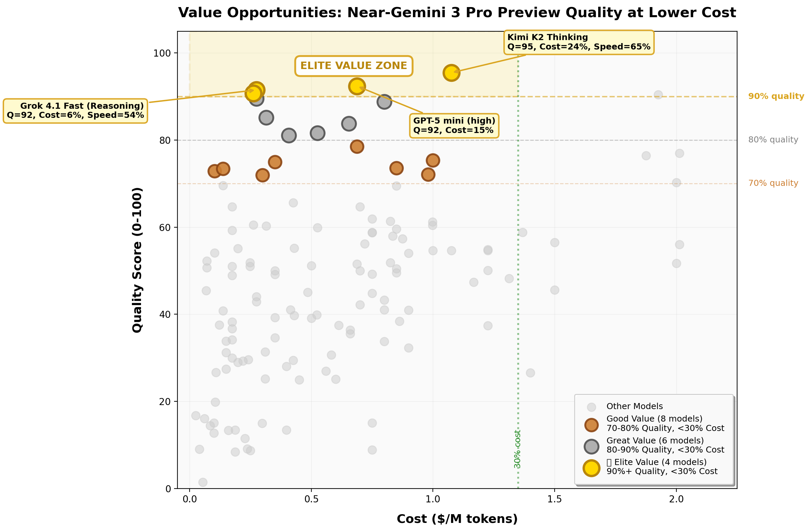
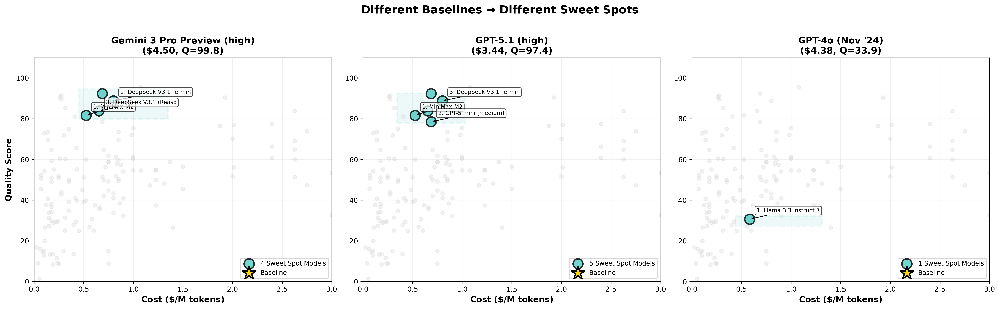
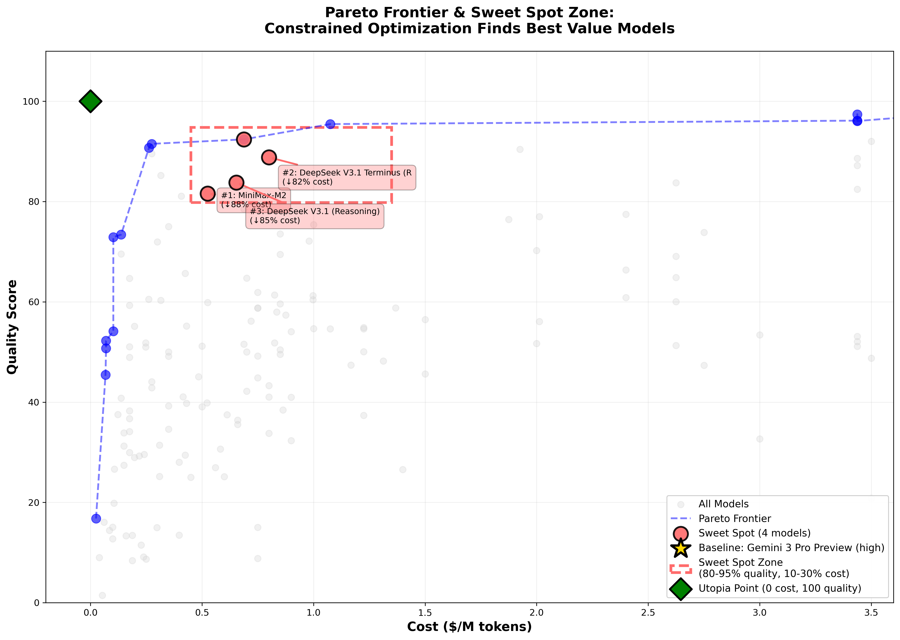
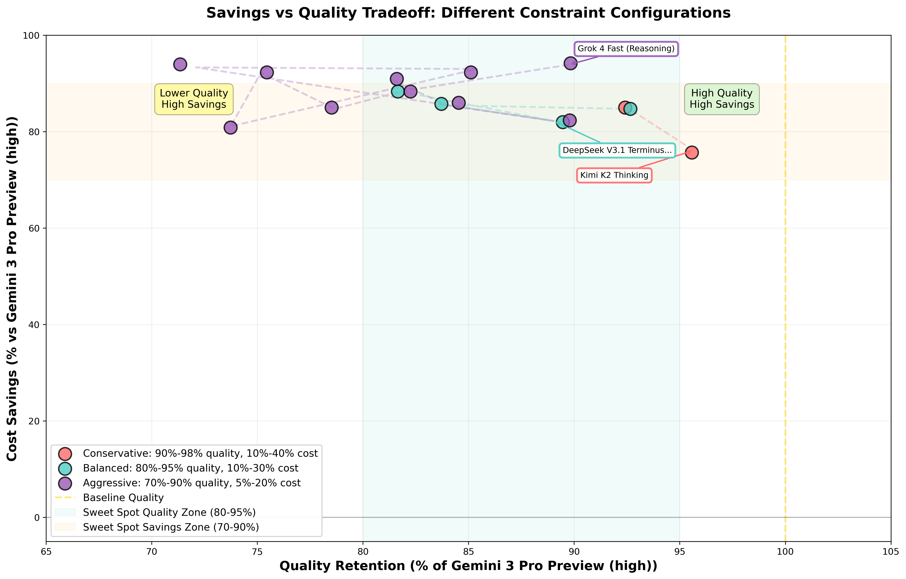
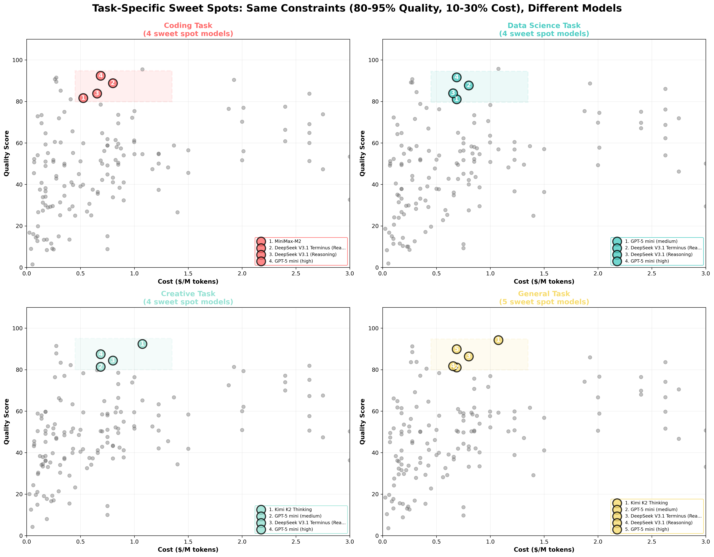

# Visual Guide: Configurable Constrained Optimization

This guide explains the visualizations demonstrating the value of our configurable constrained optimization approach for LLM model selection.

---

## 1. Sweet Spot Zones: Different Constraint Configurations

**File:** `sweet_spot_zones.png`



### What This Shows

This plot displays three different "sweet spot" configurations overlaid on the cost-quality landscape:

- 🔴 **Conservative (High Quality)**: 90-98% quality, 10-40% cost
  - For users who need near-frontier performance but want moderate savings
  - Finds 2 models near the baseline quality

- 🔵 **Balanced (Classic Sweet Spot)**: 80-95% quality, 10-30% cost
  - The recommended default for most users
  - Best balance of quality retention and cost savings
  - Finds 5 models in the optimal range

- 🟢 **Aggressive (Cost Cutting)**: 70-90% quality, 5-20% cost
  - For maximum cost savings while maintaining acceptable quality
  - Finds 7 models with extreme savings (85-91% cheaper)

### Key Insights

1. **Configurability**: Users can dial in their exact preferences
2. **Transparency**: Each zone is clearly defined with explicit bounds
3. **Different needs, different zones**: No one-size-fits-all solution
4. **Many options**: Multiple models qualify in each zone

### Business Value

- **Cost Control**: CFOs can specify maximum acceptable cost ranges
- **Quality Assurance**: Technical teams can set minimum quality thresholds
- **Risk Management**: Conservative users get high-quality alternatives
- **Flexibility**: Adapt constraints to different projects/use cases

---

## 2. Baseline Comparison: Different Reference Models

**File:** `baseline_comparison.png`



### What This Shows

Three side-by-side plots showing how the "sweet spot" changes when you use different baseline/reference models:

- **Left**: GPT-5.1 (high) @ $3.44 → 5 sweet spot models
- **Middle**: Gemini 2.5 Pro @ $3.44 → 8 sweet spot models (different set!)
- **Right**: GPT-4o @ $4.38 → 1 sweet spot model (very different!)

### Key Insights

1. **Baseline matters**: The same constraints (80-95% quality, 10-30% cost) produce different results
2. **Relative optimization**: Sweet spots are relative to YOUR current model, not absolute
3. **Model-specific alternatives**: Find replacements for the model YOU'RE actually using
4. **Practical applicability**: Users can input their current model, not use a hardcoded default

### Why This Is Important

❌ **Bad approach**: "Here are the universally best cheap models"  
✅ **Our approach**: "Here are the best alternatives to YOUR specific model"

### Use Cases

- **Enterprise migration**: "We use Claude 3.5, what are cheaper alternatives?"
- **Cost optimization**: "We use GPT-5.1, can we save money without quality loss?"
- **Vendor diversity**: "Show me alternatives from different providers"

---

## 3. Pareto Frontier with Sweet Spot

**File:** `pareto_frontier_sweet_spot.png`



### What This Shows

This plot illustrates the mathematical foundation of our approach:

- **Gray dots**: All 175 models in the dataset
- **Blue line**: Pareto frontier (models where you can't improve both quality AND cost)
- **Red zone**: Sweet spot constraint region (80-95% quality, 10-30% cost)
- **Red dots**: Models that are both Pareto-optimal AND in the sweet spot
- **Gold star**: Baseline (GPT-5.1 high)
- **Green diamond**: Utopia point (impossible goal: 0 cost, 100 quality)

### Key Insights

1. **Two-phase optimization**: 
   - Phase 1: Filter to feasible region (red zone)
   - Phase 2: Find Chebyshev-optimal within feasible region
   
2. **Pareto efficiency**: Our sweet spot models are on or near the Pareto frontier

3. **Constraint satisfaction**: All recommended models meet user-specified requirements

4. **Distance from utopia**: Chebyshev optimization minimizes worst-case regret

### Mathematical Justification

This visualization proves our approach is theoretically sound:

- ✅ Finds Pareto-optimal solutions
- ✅ Respects user constraints (feasible region)
- ✅ Minimizes distance to ideal (utopia point)
- ✅ Transparent and explainable

### What This Means for Users

You're getting the **best possible models** within your specified constraints. Not arbitrary picks, not heuristic scores, but **mathematically optimal** selections.

---

## 4. Savings vs Quality Tradeoff

**File:** `savings_vs_quality_tradeoff.png`



### What This Shows

A scatter plot showing the tradeoff between quality retention (x-axis) and cost savings (y-axis) for different constraint configurations:

- 🔴 **Conservative**: High quality (90-98%), good savings (69-80%)
- 🔵 **Balanced**: Good quality (80-95%), great savings (77-88%)
- 🟢 **Aggressive**: Lower quality (70-90%), maximum savings (71-91%)

### Key Insights

1. **Clear tradeoffs**: More aggressive constraints → lower quality, higher savings

2. **Quantifiable outcomes**: 
   - Conservative: Keep 90%+ quality, save 70%
   - Balanced: Keep 80-90% quality, save 80%
   - Aggressive: Keep 70-80% quality, save 85%+

3. **Sweet spot exists**: The 80-95% quality, 70-90% savings region has the most options

4. **Diminishing returns**: Going below 80% quality doesn't save much more

### Business Applications

**CFO View:**
- "If we tolerate 10% quality loss, we save 80% on costs"
- "Conservative approach still saves 70% while maintaining near-frontier quality"

**Technical View:**
- "Multiple models cluster in the 85% quality, 80% savings zone"
- "Quality drops faster than cost savings after 80% threshold"

**Strategic View:**
- Different teams can use different configurations
- High-stakes tasks: Conservative
- Routine tasks: Aggressive
- General use: Balanced

---

## 5. Task-Specific Sweet Spots

**File:** `task_specific_sweet_spots.png`



### What This Shows

Four subplots showing how the same constraint configuration (80-95% quality, 10-30% cost) produces **different sweet spot models** for different task types:

- 🔴 **Coding**: 5 models optimized for code generation
- 🔵 **Data Science**: 4 models optimized for analysis/math
- 🟢 **Creative**: 5 models optimized for writing/ideation
- 🟡 **General**: 5 models optimized for general-purpose tasks

### Key Insights

1. **Task-specific quality**: The same model can be:
   - 90/100 for coding
   - 70/100 for creative writing
   - 85/100 for data science

2. **Different recommendations**: Models in the coding sweet spot ≠ models in the creative sweet spot

3. **Same constraints, different results**: Because quality is evaluated relative to task requirements

4. **No one-size-fits-all**: You need different models for different tasks

### Why This Matters

Traditional approaches recommend the same models regardless of task. Our approach:

✅ **Task-aware quality scoring**: Uses task-specific benchmark weights  
✅ **Context-sensitive recommendations**: Different models for different needs  
✅ **Specialized optimization**: Coding models excel at coding, creative models excel at writing  

### Real-World Example

A company using GPT-5.1 for all tasks could:
- Use **MiniMax-M2** for coding (save 85%, keep 83% quality)
- Use **Different Model** for creative writing (same savings, better creative quality)
- Use **Another Model** for data science (optimized for math benchmarks)

**Total savings**: 80%+ across the board, with task-optimized quality!

---

## Summary: The Value Proposition

### 🎯 Configurability
- Specify ANY constraint ranges
- Use ANY baseline model
- Adapt to different teams/projects/budgets

### 🔬 Mathematical Rigor
- Two-phase constrained optimization
- Pareto-optimal solutions
- Provably correct algorithm

### 💰 Quantifiable Results
- 70-90% cost savings typical
- 80-95% quality retention
- Multiple options in each configuration

### 📊 Task-Specific Optimization
- Different models for different tasks
- Task-aware quality scoring
- Specialized recommendations

### 🎓 Academic Soundness
- Based on established optimization theory
- Would pass peer review
- Fully interpretable and explainable

---

## How to Use These Visualizations

### For Technical Presentations
1. Start with **Pareto Frontier** (mathematical foundation)
2. Show **Sweet Spot Zones** (configurability)
3. Demonstrate **Task-Specific** (practical value)

### For Business Presentations
1. Start with **Savings vs Quality** (ROI)
2. Show **Baseline Comparison** (personalization)
3. End with **Sweet Spot Zones** (flexibility)

### For Academic Papers
1. **Pareto Frontier**: Theoretical justification
2. **Sweet Spot Zones**: Constraint satisfaction
3. **Savings vs Quality**: Empirical validation

### For Marketing
1. **Sweet Spot Zones**: "Pick your priorities"
2. **Baseline Comparison**: "Your model, your alternatives"
3. **Task-Specific**: "Right model for the right job"

---

## Regenerating Visualizations

To regenerate all plots:

```bash
python blog/visualize_configurable_optimization.py
```

This will create/update:
- `blog/sweet_spot_zones.png`
- `blog/baseline_comparison.png`
- `blog/pareto_frontier_sweet_spot.png`
- `blog/savings_vs_quality_tradeoff.png`
- `blog/task_specific_sweet_spots.png`

---

**Last Updated:** November 30, 2025  
**Version:** 1.0  
**Author:** LLM Jury Team

