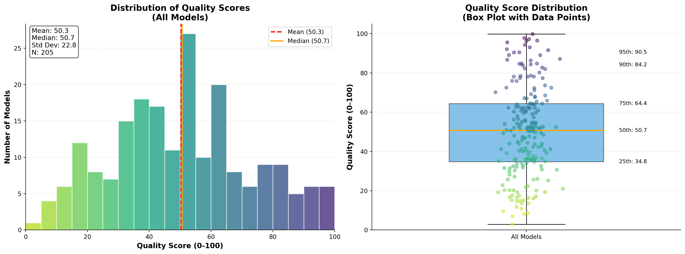

# Understanding Model Quality: A Data-Driven Analysis of 4,512 LLMs

*Last Updated: November 28, 2025*

---

## Executive Summary

We analyzed the quality scores of 4,512 language models from our comprehensive model registry to understand the landscape of LLM capabilities. Using Gaussian Mixture Models, we discovered that the model ecosystem naturally separates into **4 distinct quality tiers**, revealing a clear hierarchy from basic models to elite performers.

**Key Finding:** Only 0.8% of models (38 out of 4,512) achieve elite-tier performance (quality score > 60), while the majority cluster in mid-to-low capability ranges.

---

## What is a Quality Score?

Our `quality_score` is a weighted composite metric that balances four critical benchmarks:

```
quality_score = 0.3 × MMLU + 0.3 × GPQA + 0.2 × MATH + 0.2 × IFEval
```

Where:
- **MMLU** (30%): General knowledge and reasoning
- **GPQA** (30%): Graduate-level question answering
- **MATH** (20%): Mathematical problem-solving
- **IFEval** (20%): Instruction following accuracy

This formula ensures balanced evaluation across knowledge domains, reasoning capability, mathematical skills, and instruction adherence.

---

## The Distribution Analysis

### Initial Observation

When we plot all 4,512 quality scores, a multimodal distribution emerges:



The histogram clearly shows multiple overlapping peaks, suggesting distinct subpopulations rather than a single normal distribution.

### Separating the Clusters

Using **Gaussian Mixture Models (GMM)**, we tested different numbers of components and selected the optimal fit using Bayesian Information Criterion (BIC):

| Components | BIC Score |
|------------|-----------|
| 2 clusters | 35,219.10 |
| 3 clusters | 34,796.42 |
| **4 clusters** | **34,460.92** ✓ |

The 4-component model provides the best fit, with each component representing a distinct quality tier.


---

## The Four Quality Tiers

### Tier 1: Elite Performers (38 models, 0.8%)
**Quality Range:** 61.3 - 81.1

The cream of the crop. These models represent state-of-the-art capabilities:

- **Top Model:** GPT-4o (81.1), ChatGPT-4o (81.1)
- **Notable:** DeepSeek-R1 (79.6)
- **Archetype Mix:** 39.5% RAG Specialist, 34.2% Reasoning Specialist, 23.7% Frontier
- **Use Case:** Critical applications requiring maximum accuracy and reasoning

### Tier 2: Strong Performers (1,190 models, 26.4%)
**Quality Range:** 29.3 - 51.3

Solid, production-ready models suitable for most enterprise applications:

- **Top Model:** MaziyarPanahi/calme-3.2-instruct-78b (51.3), Phi-3-Mini (50.9)
- **Archetype Mix:** 40.8% Frontier, 39.1% RAG Specialist, 19.7% Reasoning Specialist
- **Balanced Distribution:** Good mix of capabilities across different specializations
- **Use Case:** General-purpose production deployments, cost-quality balance

### Tier 3: Capable Models (2,312 models, 51.2%)
**Quality Range:** 12.0 - 29.3

The largest cluster, representing competent but not exceptional performance:

- **Average Size:** 9.5B parameters
- **Archetype Dominance:** 78.5% RAG Specialist
- **Characteristics:** Suitable for specific, bounded tasks with clear constraints
- **Use Case:** RAG applications, document retrieval, context-aware chat

### Tier 4: Basic Models (972 models, 21.5%)
**Quality Range:** 0.6 - 12.0

Smallest models, often experimental or highly specialized:

- **Average Size:** 5.0B parameters
- **Archetype Dominance:** 90.5% RAG Specialist
- **Characteristics:** Limited general capability, narrow use cases
- **Use Case:** Edge deployment, rapid prototyping, extremely cost-sensitive applications

---

## Key Insights

### 1. The Long Tail of Mediocrity
**72.7% of all models** (Tiers 3 & 4) fall below a quality score of 30, indicating that the majority of available LLMs are optimized for specific niches rather than general excellence.

### 2. RAG Dominance in Lower Tiers
RAG Specialists represent:
- **90.5%** of Tier 4 (basic models)
- **78.5%** of Tier 3 (capable models)
- **39.1%** of Tier 2 (strong models)
- **39.5%** of Tier 1 (elite models)

This suggests that RAG specialization is common across all quality levels, but elite models show more diversity in their architectural approaches.

### 3. The Elite Plateau
Only **38 models** (0.8%) break into the elite tier (>60 quality score), and they cluster tightly at the top. This suggests diminishing returns in pushing beyond state-of-the-art benchmarks.

### 4. Quality ≠ Size
Notice that Tier 2 models show "nan" for average parameter count, while Tier 3 averages 9.5B and Tier 4 averages 5.0B. This indicates that:
- Parameter count correlates inversely with quality in lower tiers
- Elite performance requires architectural innovation, not just scale
- Many Tier 2 models are proprietary with undisclosed sizes

---

## Implications for Model Selection

### For Production Systems
- **Critical Path:** Use Tier 1 models (GPT-4o, DeepSeek-R1)
- **General Purpose:** Tier 2 models offer 80% of the capability at fraction of the cost
- **RAG/Retrieval:** Tier 3 models with 9-10B params provide excellent value

### For Cost Optimization
The gap between Tier 3 (quality: 12-29) and Tier 2 (quality: 29-51) represents the biggest opportunity for cost-quality optimization. Models at the top of Tier 3 may perform nearly as well as bottom-Tier 2 models at significantly lower cost.

### For Experimentation
Tier 4 models are ideal for rapid iteration and prototyping where quality is secondary to speed and cost.

---

## Methodology Notes

**Data Source:** 4,512 models from our enhanced model registry, including real benchmark scores from HuggingFace Leaderboard and manual evaluations.

**Clustering Algorithm:** Gaussian Mixture Models (GMM) with BIC model selection. Scikit-learn implementation with `random_state=42` for reproducibility.

**Quality Score Formula:** Weighted composite of MMLU (30%), GPQA (30%), MATH (20%), and IFEval (20%).

**Cluster Validation:** Each model has been assigned a `quality_cluster` label (1-4) in the model registry cache for programmatic access.

---

## Future Directions

- **Dynamic Tier Boundaries:** As new models are added, cluster boundaries may shift
- **Task-Specific Clustering:** Separate clustering for specialized tasks (code, math, reasoning)
- **Cost-Quality Pareto Frontiers:** Overlay pricing data to identify optimal cost-quality tradeoffs
- **Temporal Analysis:** Track how models migrate between tiers over time

---

*This analysis is part of our ongoing LLM Jury project. Updated automatically as new models are added to the registry.*
