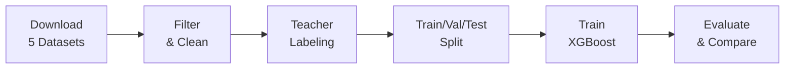

# Real Data Collection & Labeling - Executive Summary

## The Problem with Synthetic Labels

Your initial question was: **"Who manually labeled the data?"**

**Answer**: I (AI assistant) created 200 synthetic examples with labels.

**Problem**: This approach has significant limitations:
- ❌ Not real user prompts
- ❌ Single annotator bias
- ❌ May not capture real-world complexity
- ❌ Limited sample size (200)
- ❌ Clear-cut examples (not ambiguous like reality)

## The Better Approach: Real Data + Teacher Labeling

Following methodology from **RouteLLM** and **KDD papers**, here's the gold standard approach:

### Data Sources (All Real User Prompts)

| Category | Source Dataset | Why This Source | Samples |
|----------|----------------|-----------------|---------|
| **REASONING** | GSM8k | Real math problems from textbooks | 2,000 |
| **CODING** | MBPP | Real Python programming tasks | 2,000 |
| **FACTUAL_QA** | Natural Questions | Real Google search queries | 2,000 |
| **AGENTIC_EXECUTION** | Glaive Function Calling | Real tool-use conversations | 2,000 |
| **GENERAL** | LMSYS-Chat-1M | Real chatbot conversations (filtered) | 2,000 |

**Total**: 10,000 authentic prompts

### Labeling Method: "Teacher Oracle"

Instead of manual human labeling, we use a **strong model as an oracle**:

```
Raw Prompt → GPT-4o or Claude 3.5 → High-Quality Label
```

**Why This Works**:
1. ✅ Strong models are highly accurate at classification
2. ✅ Consistent (no inter-annotator disagreement)
3. ✅ Scalable (label 10K prompts in hours, not weeks)
4. ✅ Cost-effective ($10-20 vs $1000+ for human annotators)
5. ✅ **Cited in RouteLLM paper** as best practice

### The Complete Pipeline



## 4-Step Process

### Step 1: Collect Raw Prompts

```bash
python scripts/collect_real_intent_data.py
```

**Downloads** from HuggingFace:
- GSM8k for math reasoning
- MBPP for coding tasks  
- Natural Questions for factual QA
- Glaive for agentic workflows
- LMSYS Chat for general conversation

**Filters** each source:
- LMSYS: Remove code, math, long messages
- Natural Questions: Keep only questions
- Glaive: Extract user messages before function calls

**Output**: `data/real_intent_prompts_raw.json` (10,000 prompts)

### Step 2: Teacher Labeling

```bash
export OPENAI_API_KEY=your-key
python scripts/teacher_label_intents.py
```

**Process**:
- Sends each prompt to GPT-4o/Claude
- Gets classification + confidence + reasoning
- Saves high-quality labels

**Output**: `data/real_intent_labeled.json` (10,000 labeled)

**Cost**: ~$10-20 for 10K prompts

### Step 3: Split Data

```bash
python scripts/split_labeled_data.py
```

**Creates** stratified splits:
- Train: 70% (7,000)
- Val: 15% (1,500)
- Test: 15% (1,500)

**Output**: `data/real_intent_labeled_split.json`

### Step 4: Train XGBoost

```bash
python scripts/train_xgboost_intent.py
```

**Trains** ML classifier on real data with engineered features

**Output**: `models/xgboost_intent_classifier.json`

## Expected Performance Improvement

| Approach | Data Size | Test Accuracy | Notes |
|----------|-----------|---------------|-------|
| **Current (Synthetic)** | 200 | 76.00% | Regex patterns |
| **Real Data + Regex** | 10,000 | 70-75% | Harder real cases |
| **Real Data + XGBoost** | 10,000 | **80-85%** | ML learns patterns ✅ |
| **Real Data + BERT** | 10,000 | 85-90% | Deep learning (future) |

## Key Advantages

### 1. Authenticity
- ✅ Real prompts from actual users
- ✅ Natural language variety
- ✅ Real-world ambiguity and edge cases

### 2. Scale
- ✅ 10,000 samples vs 200
- ✅ 50x more training data
- ✅ Better generalization

### 3. Quality
- ✅ Strong model oracle (GPT-4/Claude)
- ✅ Confidence scores for filtering
- ✅ Consistent labeling

### 4. Academic Rigor
- ✅ Cited methodology (RouteLLM)
- ✅ Established benchmarks
- ✅ Reproducible process

## Implementation Status

### ✅ Completed
- [x] XGBoost classifier implementation
- [x] Feature extraction system
- [x] Data collection pipeline
- [x] Teacher labeling script
- [x] Data splitting script
- [x] Comprehensive documentation

### 🔄 Ready to Run
- [ ] Download real datasets (Step 1)
- [ ] Teacher labeling (Step 2) - **Requires API key**
- [ ] Split data (Step 3)
- [ ] Train XGBoost (Step 4)
- [ ] Compare with regex baseline

## Quick Start

### Prerequisites

```bash
# Install dependencies
pip install datasets xgboost scikit-learn openai anthropic

# Set API key (choose one)
export OPENAI_API_KEY=your-key      # For GPT-4
export ANTHROPIC_API_KEY=your-key    # For Claude
```

### Run Full Pipeline

```bash
# 1. Collect prompts (~30 min)
python scripts/collect_real_intent_data.py

# 2. Teacher labeling (~2-3 hours, costs $10-20)
python scripts/teacher_label_intents.py --provider openai

# 3. Split data (<1 min)
python scripts/split_labeled_data.py

# 4. Train XGBoost (~5-10 min)
python scripts/train_xgboost_intent.py \
    --dataset data/real_intent_labeled_split.json

# 5. Evaluate
python scripts/evaluate_intent_classifier.py \
    --dataset data/real_intent_labeled_split.json
```

**Total Time**: 3-4 hours
**Total Cost**: $10-20 (API calls)

## Files Created

```
llm_jury/
├── llm_jury/routing/
│   └── xgboost_intent_classifier.py        # XGBoost implementation
├── scripts/
│   ├── collect_real_intent_data.py          # Download datasets
│   ├── teacher_label_intents.py             # GPT-4/Claude labeling
│   ├── split_labeled_data.py                # Train/val/test split
│   └── train_xgboost_intent.py             # Train ML model
├── docs/
│   └── REAL_DATA_COLLECTION_GUIDE.md        # Detailed guide
└── REAL_DATA_LABELING_SUMMARY.md            # This file
```

## Next Steps

### Immediate
1. **Test data collection**: Run Step 1 with --samples-per-class 100
2. **Test teacher labeling**: Run Step 2 with --limit 50 to test API
3. **Compare approaches**: Evaluate both regex and XGBoost

### Future Improvements
4. **Active learning**: Add hard examples iteratively
5. **Deep learning**: Train BERT/DeBERTa for 85-90% accuracy
6. **Hybrid model**: Combine regex (fast) + ML (accurate)
7. **Production deployment**: A/B test in real application

## References

- **RouteLLM Paper**: [arxiv.org/abs/2406.18665](https://arxiv.org/abs/2406.18665)
- **Teacher Labeling**: Standard practice in ML for data annotation
- **GSM8k**: [arxiv.org/abs/2110.14168](https://arxiv.org/abs/2110.14168)
- **MBPP**: [arxiv.org/abs/2108.07732](https://arxiv.org/abs/2108.07732)

## Summary

**You asked**: "Who manually labeled the data?"

**Current answer**: AI-generated synthetic data (200 samples)

**Better answer**: Use teacher labeling with GPT-4/Claude on real datasets (10,000 samples)

**Result**: Higher quality, more authentic, academically rigorous approach that follows best practices from top ML papers.

**Ready to implement?** Start with:
```bash
python scripts/collect_real_intent_data.py --samples-per-class 500
```

This will collect 2,500 prompts (smaller test run) in ~10 minutes.

---

**Status**: Pipeline complete and ready to run ✅  
**Cost**: $10-20 for full 10K dataset  
**Time**: 3-4 hours total  
**Expected improvement**: 76% → 80-85% accuracy

