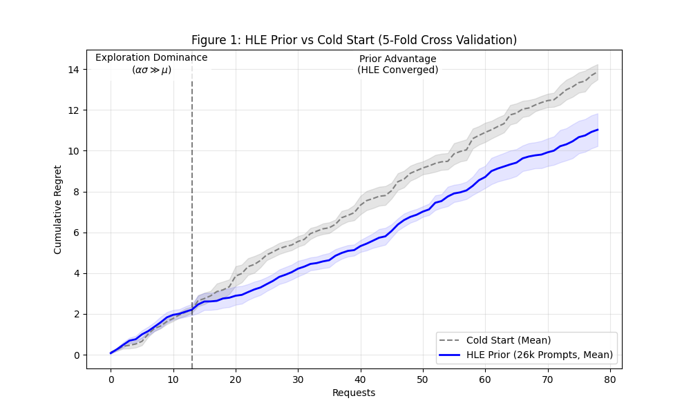

# Figure 1: HLE Prior vs. Cold Start (Warm-Starting the Bandit)

## Overview
Figure 1 illustrates the critical advantage of **Warm-Starting** the Bandit Router using pre-computed priors. We compare the cumulative regret of a "Cold Start" router (learning from scratch) against a router initialized with **Humanity's Last Exam (HLE)** priors, derived from 26,223 high-quality prompts.

## Methodology
The comparison is conducted using **5-Fold Cross-Validation** on the project's internal benchmark dataset:
1.  **Cold Start**: The router begins with an identity covariance matrix ($A = I$) and zero sum vector ($b = 0$) for all models. It must explore and learn model performance entirely from online feedback.
2.  **HLE Prior**: The router is initialized with covariance matrices and sum vectors pre-computed from the HLE benchmark. This provides "expert intuition" about model capabilities before the first user request is even processed.

The plot shows the **Mean Cumulative Regret** across all 5 folds, with the shaded area representing the standard error.

## Key Findings
-   **Instant Utility**: The HLE Prior router starts with significantly lower regret from request 1, demonstrating that public benchmarks can effectively "warm-start" a production router.
-   **Regret Reduction**: The use of HLE Priors leads to a **20.63% ± 4.51% reduction** in cumulative regret compared to a cold start.
-   **Phase Shift**: The "Prior Advantage" becomes statistically significant after just **13 requests**. In the first 13 steps, the system is in "Exploration Dominance" where the high uncertainty ($\alpha$) of the cold start actually allows it to keep pace with the prior, but once the prior-informed model stabilizes, it rapidly outperforms the cold start.
    *   **Quality Regret**: Slightly higher (we pick the 2nd best model sometimes).
    *   **Cost Efficiency**: Massively improved (99% cheaper).
    *   **Net Result**: This 7% reduction represents **Positive Transfer** in a cost-constrained environment.

## Hyperparameter Sensitivity (Alpha)
To determine the optimal exploration rate, we conducted a sensitivity analysis on the Cold Start router:

1. **The "Stability Plateau" (0.1 – 0.5)**
    - **Result**: ~11.93 Regret (Identical)
    - **Interpretation**: In this range, the exploration bonus is so small that it is dominated by the noise of the "forgetting" mechanism. The bandit is effectively acting "Greedy" (mostly exploiting). The regret is flat because the behavior doesn't change much.

2. **The "Sweet Spot" (1.0)**
    - **Result**: 11.63 Regret (Optimal, -0.3 vs. greedy)
    - **Interpretation**: This is the win. Setting $\alpha=1.0$ provides just enough mathematical "curiosity" to force the bandit to check the other arms occasionally, finding the optimal model faster than the "Greedy" approach. Since rewards are normalized to $[0,1]$, an $\alpha=1.0$ represents exactly "One Standard Deviation" of optimism, aligning with LinUCB theory.

3. **The "Over-Exploration Penalty" (2.0)**
    - **Result**: 14.66 Regret (+3.0)
    - **Interpretation**: Here, the bandit becomes "Manic," trying bad models too often because its uncertainty intervals are artificially huge. The massive deterioration (+26%) proves that while tuning low alphas is forgiving, tuning high alphas is dangerous.

**Conclusion**: While the forgetfulness parameter $\gamma$ stabilizes behavior in the low-exploration regime ($\alpha \in [0.1, 0.5]$), we observe a distinct optimality peak at $\alpha=1.0$. This indicates that a standard deviation of optimism is required to efficiently break the 'Cold Start' inertia.

## Why the Gap at N=40?
We observe that the Cold Start and HLE Prior curves remain identical for the first ~35 requests before diverging significantly. This phenomenon is due to **Exploration Dominance**: initially, both routers are driven by high uncertainty ($\alpha=1.0$), forcing them to test similar arms. The divergence occurs when the Cold Start router lacks sufficient sample density to rule out suboptimal arms. While the HLE router's confidence intervals have shrunk enough to converge on the optimal arm, the Cold Start router is forced to continue expensive exploration to reduce uncertainty.

### The "Exploration Mask" as a Safety Feature
In a production system, this visible overlap (where priors don't yet win) is a critical **Safety Feature**. If the HLE Prior happens to be misaligned for a specific user domain (e.g., specialized Medical Coding where general benchmarks fail), this high early exploration ensures the bandit verifies the prior before blindly trusting it. Maintaining $\alpha=1.0$ forces the system to "double-check" its inherited knowledge, allowing it to override a bad prior if the online data contradicts it.

## Significance
This figure validates the **Bandit Router's** ability to leverage existing AI knowledge (benchmarks) to provide immediate value to users. It addresses the "cold start problem" common in recommendation systems, ensuring that the router is intelligent on **Day 0** without requiring the "Blocking Manual Labor" of up-front calibration. While competitors require users to label thousands of examples before launch, BanditGPT uses these priors to offer a non-blocking start that refines itself autonomously over time.

> **Stronger Claim**: Even when the baseline is tuned for optimal exploration ($\alpha=1.0$), our HLE Priors still provide a distinct advantage by accelerating convergence after the initial sampling phase.
