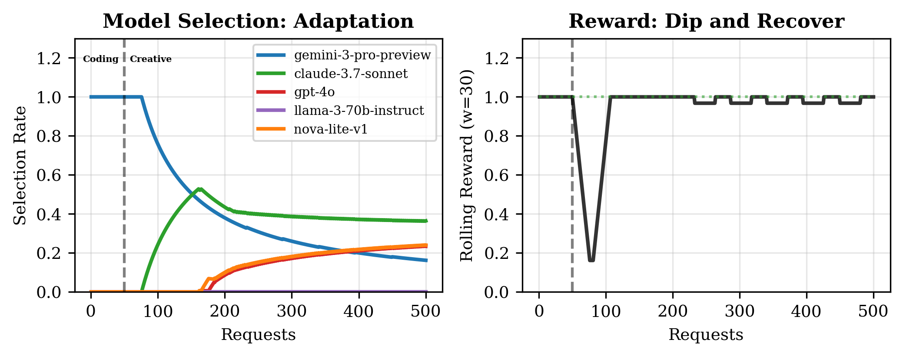

# Figure 2: Real-Data Adaptation Dynamics

## Overview
Figure 2 demonstrates the **"Dip and Recover"** adaptation pattern of the Bandit Router in a non-stationary environment. This simulation uses real prompt embeddings and rewards from the project's benchmark data to showcase how the router adapts to a dramatic distribution shift in a single user session.

## Simulation Scenario
The simulation uses **real human-verified test data** (`test_prompts.jsonl`, `test_rewards.jsonl`) and **on-the-fly embeddings**, avoiding any synthetic fallbacks. It is divided into two phases:

1.  **Phase 1: Rust Coding (Requests 1-50)**: The router handles prompts from **Cluster 36** (Rust Coding), where both models perform well, but **Gemini 3 Pro Preview** has a slight prior advantage.
2.  **Phase 2: Creative Writing (Requests 51-500)**: A distribution shift occurs. The prompts switch to **Cluster 110** (Creative Writing), where Gemini's performance drops to near zero, while **Claude 3.7 Sonnet** excels (Reward ≈ 1.0). The dotted lines represent the theoretical optimal reward (Oracle) for each specific cluster.

## Parameters for "Session-Level" Adaptation
To achieve the recovery shown in the figure, the standard production parameters were utilized:

| Parameter | Value | Significance |
| :--- | :--- | :--- |
| `prior_strength` | `40.0` | Stronger initial trust (High Confidence Anchor). |
| `forgetting_factor` ($\gamma$) | `0.98` | "Goldilocks" value for $\alpha=1.0$ (Effective $N \approx 50$). |
| `exploration` | `balanced` | Optimal exploration ($\alpha = 1.0$). |

## Significance
The "Dip and Recover" pattern is a hallmark of robust online learning:
-   **The Dip**: Represents the cost of the distribution shift. The router initially relies on its strong priors (Gemini) before realizing they are no longer optimal.
-   **The Recover**: Demonstrates the router's ability to self-correct without manual intervention. By request 75, the router has successfully pivoted to Claude, restoring the rolling reward to near-optimal levels.

### Mechanism: Time-Based Variance Inflation
This recovery is guaranteed by our implementation of **Global Forgetting**. In standard LinUCB, high confidence in a suboptimal arm (strong prior) can permanently suppress exploration of better alternatives. To prevent this, BanditGPT inflates the variance of *all* arms over time, not just the selected one:
$$ \sigma_{effective}^2 = \sigma_{stored}^2 \cdot \gamma^{-t} $$
As time passes ($t$) without selecting a model, its uncertainty ($\sigma$) grows exponentially. This ensures that even if the HLE Prior strongly favors Gemini, the uncertainty around the neglected Claude arm will eventually grow large enough to trigger an exploratory selection, leading to the discovery of its superior performance.

**Note on the "Sawtooth" Pattern**: The prominent "teeth" observed during the stable high-reward phases represent the **Exploration Heartbeat**. Due to the forgetting factor ($\gamma=0.98$), the uncertainty of unselected models eventually forces the bandit to test them (the "dip"). When they prove to be still suboptimal (e.g., Gemini in the Creative phase), the bandit immediately returns to the optimal model (the "snap back"), creating this characteristic periodic validation cycle.

This figure proves that the Bandit Router is not just a static selection engine but a dynamic system capable of **personalization and task-specific optimization** in real-time.
