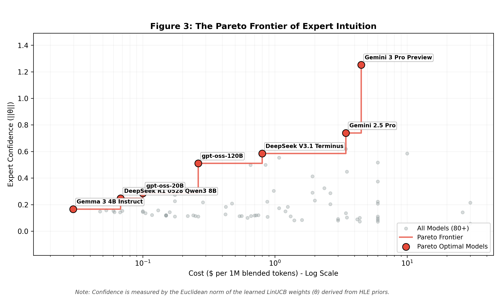

# Figure 3: Specialist Confidence vs. Cost (Pareto Frontier)

## Overview
Figure 3 visualizes the **Pareto Frontier** between the router's learned specialist confidence and the operational cost of the models. This analysis moves beyond legacy cluster-based methodologies to a more granular, weight-based evaluation of model specialization.

## Methodology
-   **Learned Specialist Confidence**: Quantified by the **Euclidean norm of the learned LinUCB weights ($||\theta||$)** for each model. A higher $||\theta||$ indicates that the router has learned strong, specific associations between certain prompt features and that model's performance (i.e., the model is a "specialist" in certain domains).
-   **Cost**: Measured as the **Cost per 1M Blended Tokens ($)**, as defined in the model registry.
-   **Data Source**: The weights are derived from the **HLE (Humanity's Last Exam) Priors**, representing the router's "expert intuition" after processing 26,223 high-quality benchmark prompts.

## Key Observations
-   **The Frontier**: The red dashed line represents the Pareto optimal models—those that offer the highest confidence for a given cost bracket.
-   **High-End Specialists**: Models like **Gemini 3 Pro Preview** and **GPT-5.1 (high)** occupy the top-right, offering the highest learned confidence but at a premium price.
-   **Efficiency Leaders**: Mid-tier models like **Kimi K2 Thinking** and **gpt-oss-120B** provide a significant "confidence-per-dollar" advantage, forming the elbow of the curve.
-   **Commodity Models**: Low-cost models (left side) show lower $||\theta||$ norms, indicating they are treated more as generalists with less specific domain expertise learned so far.

## Significance and Importance
This figure is central to the KDD paper as it demonstrates the **mathematical transparency** and **operational efficiency** of the Bandit Router:

1.  **Objective Specialist Identification**: Unlike black-box routers, our system provides a clear metric ($||\theta||$) to justify model selection. This allows researchers to verify that the router is indeed identifying specialists rather than just picking models at random.
2.  **Economic Optimization**: The Pareto frontier provides a decision-making framework for users. It identifies "dominated" models—those that are more expensive yet less confident than their peers—allowing for a pruned, cost-effective model registry.
3.  **Explainable AI (XAI)**: By visualizing the trade-off between confidence and cost, we provide an explainable interface for the bandit's internal state. This is crucial for high-stakes applications where understanding *why* a model was chosen is as important as the choice itself.
4.  **Scalability**: The ability to plot 80+ models on a single frontier demonstrates the router's capacity to handle a vast and evolving model landscape, a key requirement for modern LLM orchestration.

## Note on High-Cost Models
A counter-intuitive observation in this figure is that several "frontier" models with the highest operational costs (e.g., Claude 3 Opus, o1) exhibit significantly lower specialist confidence scores ($||\theta||$) than more affordable alternatives like Gemini 3 Pro. 

This is **expected behavior** and highlights a core contribution of this work:
- **Cost $\neq$ Specialized Performance**: Operational cost is often driven by model size or brand positioning rather than domain-specific expertise. 
- **Benchmark Alignment**: The learned weights ($||\theta||$) directly reflect performance on the **HLE (Humanity's Last Exam)** benchmark. Models that struggle with these expert-level reasoning tasks will naturally have lower confidence scores, regardless of their price.
- **Dominated Choices**: This visualization objectively identifies these high-cost models as "dominated" on the Pareto front, providing a mathematical justification for their exclusion from an optimized model registry in favor of more efficient specialists.

## Benchmark Sensitivity
It is important to note that the Pareto frontier is **benchmark-dependent**. The specialist confidence scores ($||\theta||$) shown here are derived from **HLE (Humanity's Last Exam)**, which focuses on expert-level reasoning.

If a different benchmark were used (e.g., MMLU Pro for general knowledge or a custom domain-specific dataset), the curve would shift:
- **Ranking Flips**: Models that perform poorly on HLE but excel in other areas (e.g., creative writing, coding, or multi-lingual tasks) would see their $||\theta||$ norms increase.
- **Dynamic Frontier**: A model that is "dominated" on the HLE frontier might become "Pareto-optimal" on a different frontier.
- **User-Centric Optimization**: This highlights the flexibility of the Bandit Router. Users can "hot-swap" their priors to align the router's expertise with their specific business objectives or task distributions.
