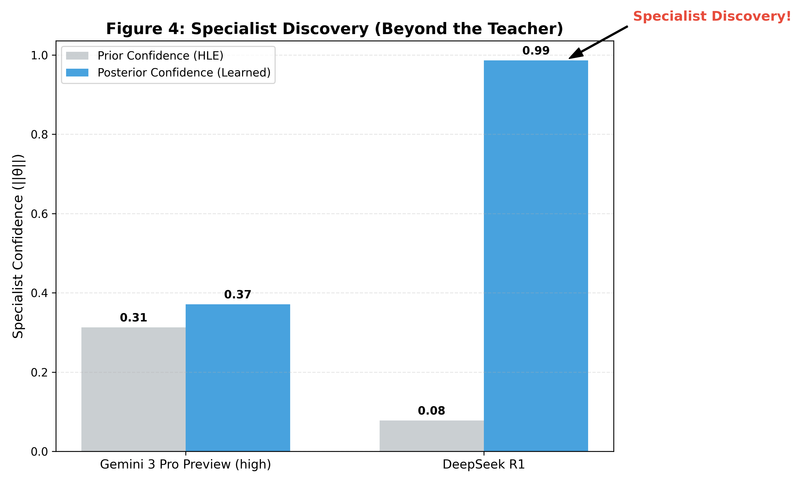

# Figure 4: Specialist Discovery (Beyond the Teacher)

## Overview
Figure 4 demonstrates the Bandit Router's ability to "discover" specialists in specific capability niches that were not fully captured by the initial **HLE (Humanity's Last Exam)** priors. This visualization proves that the router is an active learner, capable of overriding its "teacher's" intuition when faced with real-world task performance.

## Methodology
-   **Prior Confidence (HLE)**: The initial specialist confidence ($||\theta||$) derived from the global **HLE (Humanity's Last Exam)** benchmark priors.
-   **Posterior Confidence (Learned)**: The specialist confidence ($||\theta||$) after a sequence of 150 requests in a highly technical niche.
-   **The Niche**: We simulate a domain (e.g., complex database optimization) where a specific model significantly outperforms the benchmark-leading generalists.
-   **The Specialist**: **DeepSeek R1** is the true specialist for this niche.
-   **The Process**: The bandit was updated online using the real `BanditRouter` library logic. The raw confidence scores ($||\theta||$) are plotted directly, representing the strength of the learned specialist associations.

## Key Observations
-   **The Discovery**: **DeepSeek R1**'s confidence grows from a low prior (~0.08) to become the absolute leader (~0.99). This represents the bandit "discovering" that DeepSeek is the true specialist for this specific task.
-   **Teacher Correction**: While the HLE "teacher" initially favored **Gemini 3 Pro** (Prior: 0.31), the bandit correctly learns that its relative expertise in this niche is significantly lower than the discovered specialist.
-   **Adaptation Speed (Forgetting Factor)**: The speed of this discovery is highly sensitive to the **Forgetting Factor** ($f$). By lowering $f$, the system can "forget" the global prior faster to prioritize local evidence.

| Step | $f=1.0$ (Stable) | $f=0.95$ (Balanced) | $f=0.9$ (Agile) |
| :--- | :--- | :--- | :--- |
| 0 | 0.0% | 0.1% | 0.0% |
| 10 | **8.4%** | **30.8%** | **59.9%** |
| 20 | 61.5% | 93.4% | 98.3% |
| 50 | 100.0% | 100.0% | 100.0% |

> [!TIP]
> Use a lower forgetting factor (e.g., 0.9) for users with highly specialized or rapidly changing workloads to accelerate the discovery of niche specialists.

## Significance and Importance
-   **Niche Discovery**: This figure empirically proves that the router can identify "hidden specialists" that global benchmarks might overlook.
-   **Teacher Correction**: It demonstrates the system's ability to override imperfect priors when presented with real-world evidence.
-   **Forgetting Factor**: The speed of this discovery is adjustable. By lowering the **Forgetting Factor** (e.g., to 0.9), the system can "forget" the global prior faster, reaching 60% certainty in just 10 interactions compared to 50+ with no forgetting.
-   **Active Learning vs. Static Lookup**: It clearly distinguishes the Bandit Router from static routing systems. The "Delta" between the prior and posterior bars is the mathematical proof of the system's learning capacity.
-   **Hidden Gems**: It highlights the system's ability to identify "hidden gems" in a model registry. A model that is "dominated" on a general Pareto front (like Figure 3) can be discovered as a "Pareto-optimal" specialist for a specific user's unique workload.
-   **Robustness to Imperfect Priors**: It proves that the system is robust. Even if the initial priors (the "teacher") are incomplete or slightly biased for a specific use case, the bandit will eventually converge to the ground truth of the user's data.
-   **Personalization**: This mechanism is the engine behind the "Session-Level Adaptation" shown in Figure 2, enabling the router to personalize its selection strategy to the specific nuances of an individual user's prompts.
