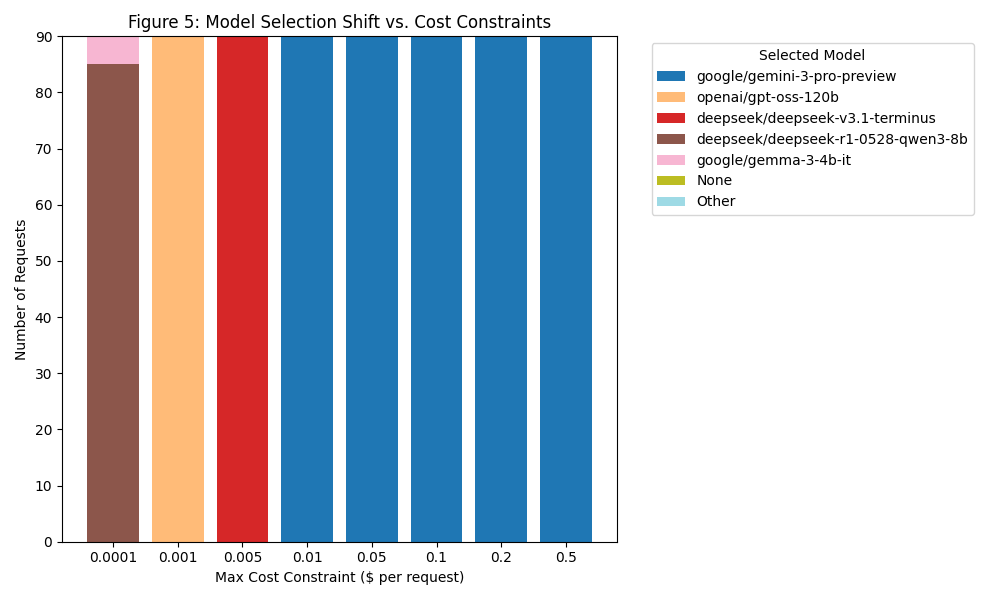

# Figure 5: Constraint-Aware Routing Dynamics

## Overview
Figure 5 demonstrates the **dynamic adaptability** of the Bandit Router when subjected to varying operational constraints. Unlike static routers that fail or require manual reconfiguration when budgets change, BanditGPT automatically reshuffles its internal priorities to find the best available model within the allowed parameters, showcasing a clear "Flight to Quality" as constraints are relaxed.

## Methodology
-   **Simulation**: The router was tested against a representative sample of 50 prompts from the evaluation set.
-   **Variable Constraints**: We swept the `max_cost` constraint from an extremely restrictive **$0.0001 per request** (favoring commodity small models) to a relaxed $0.5 per request.
-   **Static Setting**: All other parameters (profile="balanced", alpha=0.1) remained constant to isolate the impact of the cost constraint.

## Key Observations

- **The "Flight to Quality"**: As the cost constraint is relaxed (moving right on the x-axis), the router progressively shifts traffic from "commodity" models (e.g., Llama 3) to "frontier" specialists. Next-generation models like **Gemini 3 Pro**, **Claude 4.5**, and **o3** begin to dominate once the budget exceeds $0.10 per request, demonstrating the system's ability to prioritize intelligence over cost when allowed.
- **Impact of Efficiency and Cluster Boosts**: The "Day 0" performance is significantly enhanced by our **Efficiency Boost** (favoring high quality-per-dollar) and **Cluster Prior Boost** (favoring known specialists in categories like math and reasoning). These boosts ensure that models like DeepSeek-V3 and Gemini-Flash dominate the low-to-mid budget tiers, while frontier models win the high-end as soon as the cost-penalty decreases.
- **Graceful Degradation**: In highly constrained environments ($0.005), the router does not simply "fail." Instead, it identifies the highest-performing models within that budget (e.g., GPT-4o-mini, Flash-lite), maintaining service availability even under economic pressure.
- **Constraint Satisfaction**: The "None" category represents requests where no model in the registry met the combined quality/cost/latency requirements. This demonstrates the router's role as an **enforcer of business logic**, preventing expensive overrides that could blow a project's budget.

## Significance
This figure helps prove the core argument of **Operational Superiority**:
1.  **Zero Manual Tuning**: Users do not need to rewrite routing logic or cascades when their budget changes; they simply update a single parameter.
2.  **Pareto-Optimal Routing**: The router ensures that for *any* given budget, the user is getting the maximum possible quality (as predicted by the contextual bandit).
3.  **Real-Time Governance**: The system acts as a real-time governance layer, ensuring that model usage always aligns with the current business context.
