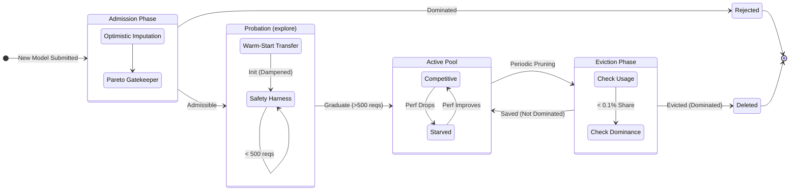

# BanditRouter Workflow: From Prompt to Model Selection

This walkthrough details the exact path a user prompt takes through the `BanditRouter` to select the optimal model.

## 1. Initialization (One-Time)
When the router is created, it establishes its belief state using the offline priors.

> **Convergence Strategy**: The feature space is high-dimensional (397 dims), which would normally require ~10k requests to converge ("The Curse of Dimensionality").
> We solve this by injecting **Informative Priors** ($N_{eff}$), which act as a "warm start" bridge, allowing the router to perform well immediately while maintaining plasticity for fine-tuning.

*   **Parameters**:
    *   `prior_n_effective` ($N_{eff} = 20.0$): The weight of the offline prior.
    *   `ridge_lambda` ($\lambda = 1.0$): Regularization for numerical stability.
*   **Initial State ($t=0$)**:
    *   For each model $m$:
        *   $A_m = \lambda I + \gamma \Sigma_{offline}$ where $\gamma = N_{eff} / N_{total}$
        *   $b_m = \gamma \vec{S}_{offline}$ (Scaled sum of success-weighted vectors)
        *   $A^{-1}_m$ is pre-computed.

## 2. Request Handling: `router.route(prompt)`

### Step A: Feature Extraction
The raw text prompt is converted into a dense feature vector $\mathbf{x} \in \mathbb{R}^{46}$.

> **Design Rationale**: We use a Hybrid Feature Set to address the limitation of purely semantic embeddings.
> *   **Dense Embedding**: Captures **Domain/Topic**. Compressed via PCA ($384 \to 32$) to reduce dimensionality.
> *   **Explicit Features**: Captures **Complexity/Difficulty**. Retained raw to preserve high-signal complexity indicators.

1.  **Semantic Embedding** (32 dims): `sentence-transformers/all-MiniLM-L6-v2` embedding ($384$), projected to $32$ dims via pre-trained **PCA**.
2.  **Handcrafted Features** (8 dims): Explicit heuristics (e.g., Code Density, JSON) retained raw.
3.  **Cluster Distances** (5 dims): Distance to 5 **Fixed Cannonical Anchors** (Math, Coding, Writing, Jokes, Reasoning), defined as the centroids of the 5 most distinct clusters in the Offline Set.
    *   *Stability*: Unlike "nearest clusters" which change per prompt, fixed anchors provide a stable coordinate system for the linear model to learn "Math-ness" or "Code-ness".
4.  **Bias Term** (1 dim): A constant `1.0` is appended.
    *   **Total Dimensions**: $32 + 8 + 5 + 1 = 46$. (Converges $8\times$ faster than 397 dims).

### Step B: Candidate Filtering & Gating
Before scoring, the router filters the list of available models.

1.  **Risk Gating**: A sensitivity classifier scans the prompt.
    *   **HIGH Risk** (Medical/Legal): Filters out models with varying safety profiles, enforcing a "Safe Subset".
    *   **LOW/MID Risk**: All models are candidates.
2.  **Constraints**: User-defined constraints (max cost, max latency) remove ineligible models.

### Step C: UCB Scoring (The Core Logic)
For each valid candidate model $m$, the router calculates an Upper Confidence Bound (UCB) score.

1.  **Posterior Mean**: $\hat{\mu}_m = \mathbf{x}^T (A_m^{-1} b_m)$
    *   Predicts the expected utility (0-1) of the model for this specific prompt.
2.  **Uncertainty (Std Dev)**: $\sigma_m = \sqrt{\mathbf{x}^T A_m^{-1} \mathbf{x}}$
    *   Measures how little we know about this region of the feature space.
    *   *Staleness Update*: We apply an exponential decay factor $\lambda_{forget}$ to the covariance matrix $A_m$ at each step, naturally inflating $\sigma_m$ for unvisited arms to encourage re-exploration.
3.  **UCB calculation**: $Score_m = \hat{\mu}_m + \alpha \cdot \sigma_m$
    *   $\alpha$ (0.1): Controls exploration vs exploitation.

### Step D: Selection & Optimization Profile
The router combines the UCB quality score with **Normalized** Cost and Latency penalties based on the chosen profile (e.g., `best_value`).

To prevent "Unit Mismatch" (where tiny $ values or large Latency seconds dominate), we apply **Log-MinMax Normalization** relative to the *current candidate pool*.

1.  **Normalization**:
    *   $C'_{m} = \log(\max(Cost_m, \epsilon))$
    *   $Cost^{norm}_m = \frac{C'_m - \min(C')}{\max(C') - \min(C')}$
    *   (0.0 = Cheapest in pool, 1.0 = Most Expensive)
    *   Latency is normalized similarly in log-space.

2.  **Scoring Equation**:
    $$ \text{FinalScore}_m = \text{UCB}_m - \lambda_{cost} \cdot \text{Cost}^{norm}_m - \lambda_{latency} \cdot \text{Latency}^{norm}_m $$
    *   $\lambda=1.0$ now means "The full swing from cheapest to most expensive is as important as a full 0-1 swing in Quality."

*   The model with the highest **FinalScore** is selected.

---

## 3. Data Preparation & Splitting strategy
To ensure rigorous evaluation and prevent data leakage, we employ a **Stratified Cluster Splitting** strategy.

### Source Data
We start with a large corpus of prompts, pre-clustered into $K=100$ semantic clusters (e.g., "Python Coding", "Creative Writing", "Medical Diagnosis").

### Splitting Methodology
We divide the corpus into three disjoint sets:
1.  **Evaluation Sets (Train/Test)**:
    *   **Test Set** ($N=1000$): Stratified sample ensuring coverage of all 100 clusters. Used *only* for final performance reporting.
    *   **Training Set** ($N=4000$): Stratified sample ensuring coverage of all 100 clusters. Used for hyperparameter tuning.
    *   **Stratification**: We use proportional allocation based on cluster size to ensure the evaluation sets reflect the true distribution of user intent.

2.  **Prior/Offline Set** (Remaining $\sim 20k+$):
    *   **Strict Exclusion**: Any prompt appearing in Train or Test is **strictly excluded** from this set.
    *   **Usage**: accurate Priors (Contextual Covariance Matrix) and Unsupervised PCA training.

> **Zero Leakage Guarantee**: The Bandit's prior belief state (and its PCA coordinate system) is constructed *solely* from the Offline Set. It has never "seen" the Train or Test prompts, ensuring the simulation reflects a true cold-start or online learning scenario.

## 4. Post-Selection (Feedback Loop)
1.  **Logging**: The request, context vector $\mathbf{x}$, and selection are logged.
2.  **Feedback (Async)**: When ground truth (or user feedback) is received:
    *   `router.update(model, x, reward)`
    *   $A_m \leftarrow A_m + \mathbf{x}\mathbf{x}^T$
    *   $b_m \leftarrow b_m + r \cdot \mathbf{x}$
    *   The router learns in real-time, refining its belief state.

## 5. New Model Admission ("Transfer & Verify" Protocol)
This process runs whenever a new model (e.g., New-Model-Z) is added to the candidate pool.

### Phase 1: Admission (The Optimistic Gatekeeper)
Before modifying any matrices, we determine if New-Model-Z is theoretically viable.

1.  **Impute Optimistic Reward**: Assume the new model has perfect quality ($Reward = 1.0$) but retains its published Price and Latency.
2.  **Pareto Check**: Plot this "Optimistic Point" against existing models.
    *   **If Dominated**: Reject immediately. (e.g., If it costs $10 but is slower than GPT-4o, even perfect quality won't save it).
    *   **If Non-Dominated**: Proceed to Initialization.

### Phase 2: Initialization (Latent Space Warm-Start)
We construct the initial belief state ($A_{new}, b_{new}$) by transferring knowledge from similar existing models.

1.  **Metadata Vectorization**: Create a static feature vector $V$ for the new model and all existing models:
    $$V_{model} = [\text{Norm(Cost)}, \text{Norm(Latency)}, \text{Norm(HLE\_Score)}, \text{Context\_Window\_Log}]$$
2.  **Neighbor Identification**: Calculate Euclidean distance between $V_{new}$ and all $V_{existing}$. Select the top $K=3$ nearest neighbors ($\mathcal{N}$).
    *   *Intuition*: If New-Model-Z has the same price/speed/specs as Llama-3-70b, it likely has a similar performance profile.
3.  **Parameter Transfer**: Compute the average belief state of the neighbors:
    $$A_{avg} = \frac{1}{K} \sum_{j \in \mathcal{N}} A_j$$
    $$b_{avg} = \frac{1}{K} \sum_{j \in \mathcal{N}} b_j$$
4.  **Uncertainty Inflation (Dampening)**: Scale down confidence to ensure exploration ($\epsilon = 0.1$):
    $$A_{new} = \epsilon \cdot A_{avg} + (1-\epsilon)\lambda I$$
    $$b_{new} = \epsilon \cdot b_{avg}$$
    *   *Result*: The new model inherits knowledge (high predicted reward for specific clusters) but has wide confidence intervals, triggering high UCB scores.

### Phase 3: Exploration (Probation Mode)
The model is now live with a safety harness.

1.  **Probation Flag**: Mark status="PROBATION".
2.  **Pruning Immunity**: For the first $N=500$ requests, this model cannot be pruned by the dynamic Pareto filter.
3.  **Graduation**: After $N$ samples, remove the PROBATION flag. The model now lives or dies by its own merit.

## 6. Eviction (Dynamic Action Space Reduction)
To maintain system efficiency, we employ a "Lazy Pruning" mechanism to remove models that have failed to perform.

### Step 1: The Natural Death (Mathematical Starvation)
*   **Mechanism**: As real feedback dictates that a model is poor, its learned mean ($\mu$) drops and its uncertainty ($\sigma$) shrinks (as we get more data).
*   **Effect**: The UCB score ($\mu + \alpha \sigma$) collapses, and the model's traffic share drops to near 0%.

### Step 2: The Formal Eviction (Garbage Collection)
A periodic cleanup job (e.g., every 1k requests) removes "starved" models to save compute.

1.  **Re-Calculate Pareto Frontier**: We compute the **Learned Quality** ($\hat{\mu}_{avg}$) for each model by averaging its predicted utility across a representative sample of recent contexts.
2.  **Dominance Check**: A model implies "Strict Dominance" if another model exists that is:
    *   **Cheaper** ($Cost_B < Cost_A$)
    *   **Better** ($\hat{\mu}_B > \hat{\mu}_A$)
3.  **The Threshold**:
    *   **Selection Rate**: $< 0.1\%$ (Starved)
    *   **Condition**: Strictly Dominated
    *   **Action**: **DELETE**. The model is removed from the registry and its matrices ($A^{-1}$) are freed.

## 7. Lifecycle Visual Summary

*Figure 3: The lifecycle of a Bandit Arm. Models enter via Optimistic Admissibility, survive Probation via Prior Dampening, and are eventually garbage-collected if they become Pareto-dominated.*
